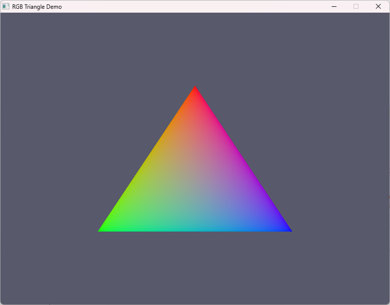
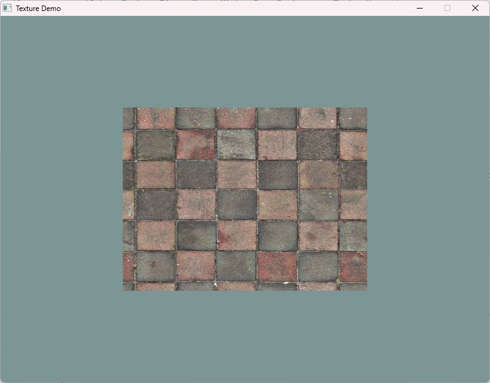
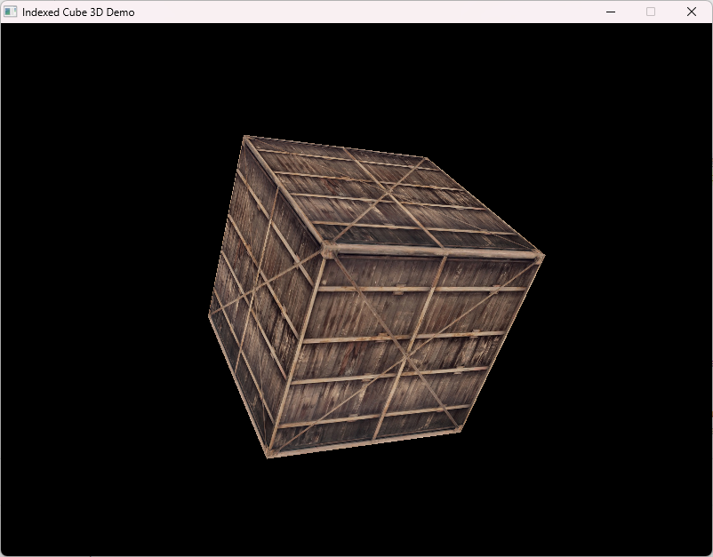
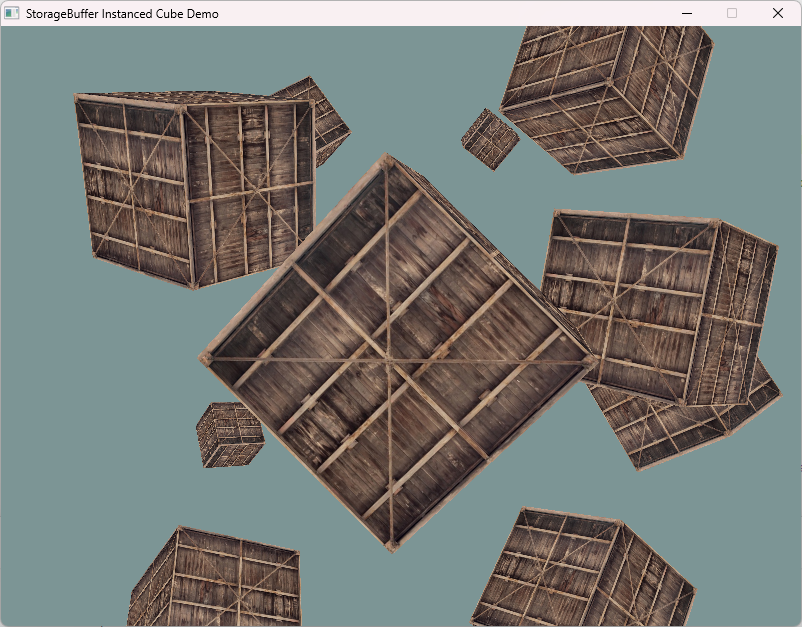

# ⭐ Starfish Game Lib

> **基于 wgpu + SDL3 跨平台游戏库**  
> 致力于打造次世代pygame！\
> 服务于python 图形化原型开发者,简单而不失细节！\
> 专注于现代图形渲染，以简洁的 Builder API 和 Pygame 兼容层为特色！

[](https://www.rust-lang.org)
[](https://wgpu.rs/)
[](https://wiki.libsdl.org/SDL3/)
[](LICENSE)

---

## 📸 截图
<table>
  <tr>
    <td></td>
    <td></td>
  </tr>
  <tr>
    <td align="center">02_triangles — 彩色三角形</td>
    <td align="center">03_texture — 纹理贴图正方形</td>
  </tr>
  <tr>
    <td></td>
    <td></td>
  </tr>
  <tr>
    <td align="center">04_coord_system — MVP 旋转立方体</td>
    <td align="center">05_storage_cube — 实例化渲染 + FPS 相机</td>
  </tr>
</table>

---

## 🖼️ 第三方美术资源
素材取自 LearnOpenGL
作者 Joey de Vries
来源：https://learnopengl.com
许可协议：Creative Commons Attribution 4.0 International (CC BY 4.0)

素材取自 SampleLib
来源：https://samplelib.com/zh/
许可说明：网站原创测试文件，无许可限制，允许下载、修改、使用；素材按现状提供，不提供担保。


## ✨ 特性

### 🎨 渲染系统 (wgpu)

- **RenderSurface & RenderResourceAccess** — Surface/Device/Queue 全生命周期管理，自动创建深度缓冲和遮挡查询
- **Builder 风格 API** — `MeshBuilder`、`PipelineBuilder`、`BindGroupBuilder`、`ShaderModuleBuilder`
- **管线配置丰富**:
  - 深度模式：Standard / Reverse Z / Disabled
  - 混合模式：Opaque / Alpha / Additive / Multiply / Custom
  - 面剔除、线框模式、MSAA、Stencil、Depth Bias
- **纹理全维度支持**: 1D / 2D / 3D / Cube / Array，Mipmap 策略可控
- **Uniform + Storage Buffer**: 自动对齐布局，支持 StructLayout 描述
- **Compute Pipeline**: 计算着色器管线
- **实例化渲染**: GPU 实例化，StorageBuffer 批量更新
- **间接绘制**: GPU Driven 渲染管线基础支持
- **独立 Mipmap 生成**: 内置 mipmap 生成扩展模块

### 🪟 窗口系统 (SDL3)

- 全屏、无边框、窗口模式切换
- 鼠标锁定、相对模式（FPS 相机）
- 高 DPI 支持、窗口透明度、点击测试
- 窗口置顶、最小化/最大化、居中

### 🎮 输入子系统

- 键盘、鼠标（含相对运动）
- 手柄、摇杆、力反馈
- 传感器、摄像头
- 自定义事件

### 🔊 音频子系统

- 播放/录音设备枚举
- 回调式音频流
- 音频格式转换

### 🧮 数学库

- 自定义 Vec2/3/4、Mat3/4、Quaternion
- 几何体：AABB、OBB、Sphere、Frustum、Ray、Capsule、Cone、Cylinder、Circle、Rect、Line
- CGmath + Glam 双重数学库支持

### 🐍 Pygame 兼容层

> 为 2D 游戏开发者提供熟悉的 API

- **`pygame.Color`** — RGBA/HSVA/HSLA/CMY/I1I2I3 色彩空间，运算符重载，惰性缓存，Gamma 校正
- **`pygame.Rect`** — 完整碰撞检测、clip/clamp/union/fit/scale、字典碰撞、线段裁剪
- **`base::color::Color`** — HDR 浮点颜色，f64 精度

---

## 🗂️ 项目结构

```
starfish/
├── Cargo.toml              # 依赖配置
├── examples/               # 示例程序（推荐从 01 开始）
│   ├── 01_hello_world.rs   # 清屏
│   ├── 02_triangles.rs     # 彩色三角形
│   ├── 03_texture.rs       # 纹理贴图
│   ├── 04_coord_system.rs  # MVP 3D 立方体
│   └── 05_storage_cube.rs  # 实例化渲染 + FPS 相机
├── resources/              # 资源文件（纹理、着色器）
└── src/
    ├── lib.rs              # 根模块
    ├── base/               # ⚙️ 核心引擎
    │   ├── render/         #   渲染系统
    │   ├── maths/          #   数学 + 几何体
    │   ├── subsystem/      #   窗口/音频/输入子系统
    │   ├── window/         #   窗口封装
    │   ├── resources/      #   资源加载
    │   ├── time/           #   时间工具
    │   ├── color.rs        #   浮点颜色（HDR）
    │   └── error.rs        #   错误类型
    └── pygame/             # 🐍 Pygame 风格接口
        ├── color.rs        #   Color（完整实现）
        └── rect.rs         #   Rect（完整实现）

```

---

## 🚀 快速开始

### 环境要求

- Rust 1.85+
- 支持 Vulkan / Metal / DX12 的显卡
- CMake（SDL3 编译依赖）

### 运行示例

```bash
# 最简示例：清屏
cargo run --example 01_hello_world

# 彩色三角形
cargo run --example 02_triangles

# 纹理贴图（需 resources/textures/wall.jpg）
cargo run --example 03_texture

# 3D MVP 旋转立方体（需 resources/textures/container.jpg）
cargo run --example 04_coord_system

# 🏆 推荐！实例化立方体 + FPS 相机（最完整的示例）
cargo run --example 05_storage_cube
```

### 在自己的项目中使用

```toml
[dependencies]
starfish = { git = "https://github.com/GuYeying/starfish" }
```

```rust
use starfish::base::{
    render::render_entry::RenderEntry,
    subsystem::{EventSubsystem, VideoSubsystem},
    window::Window,
};
use sdl3::{event::Event, video::WindowFlags};

fn main() {
    let sdl = sdl3::init().unwrap();
    let video = VideoSubsystem::new(&sdl);
    let _event = EventSubsystem::new(&sdl);
    let window = Window::new(&video, "My Game", (800, 600), WindowFlags::default()).unwrap();
    let (context,resouce,mut surface) = RenderEntry::new(&window, None, None).unwrap();
    let mut running = true;
    while running {
        for event in sdl.event_pump().unwrap().poll_iter() {
            if let Event::Quit { .. } = event {
                running = false;
            }
        }
        surface.begin_frame(wgpu::Color { r: 0.1, g: 0.1, b: 0.15, a: 1.0 }, 1.0);
        surface.present();
    }
}
```

---

## 📚 示例详解

| 示例 | 展示内容 | 关键 API |
|------|---------|----------|
| 01_hello_world | 窗口创建 + 清屏 | `RenderContext::new`, `begin_frame`, `present` |
| 02_triangles | 顶点数据 + 着色器 + 管线 + 绘制 | `ShaderModuleBuilder`, `MeshBuilder`, `RenderPipelineBuilder` |
| 03_texture | 纹理加载 + 采样器 + BindGroup | `create_texture`, `create_sampler`, `BindGroupBuilder` |
| 04_coord_system | MVP 矩阵 + 索引缓冲 + 3D 深度 + 旋转 | Uniform Buffer, `render_pipeline_builder_3d`, `draw_mesh` |
| 05_storage_cube | 实例化渲染 + StorageBuffer + FPS 相机 | `StorageBuffer`, `draw_mesh_instanced`, 鼠标控制 |

---

## 🛠️ 技术栈

| 组件 | 技术 | 版本 |
|------|------|------|
| 图形 API | [wgpu](https://wgpu.rs/) | 30.0 |
| 窗口/输入 | [SDL3](https://wiki.libsdl.org/SDL3/) | 3.4.12 |
| 数学 | [glam](https://docs.rs/glam/) + [cgmath](https://docs.rs/cgmath/) | 0.33 / 0.18 |
| 纹理加载 | [image](https://docs.rs/image/) | 0.25 |
| 模型加载 | [gltf](https://docs.rs/gltf/) | 1.4 |
| 字体解析 | [ttf-parser](https://docs.rs/ttf-parser/) | 0.25 |
| 序列化 | [serde](https://serde.rs/) + [serde_json](https://docs.rs/serde_json/) | 1.0 |
| 错误处理 | [thiserror](https://docs.rs/thiserror/) | 2.0 |
| 内存映射 | [bytemuck](https://docs.rs/bytemuck/) | 1.23 |

---

## 📋 开发路线图
- Phase1：完善 Rust 原生底层渲染、音频模块，音频混音管理，搭建稳定底层底座
- Phase2：搭建 完整 CPU 资源体系，实现基础几何体生成器、不同资源文件类型
- Phase3：完善 starfish底层的接口文档,让开发者和AI更容易了解该库
- Phase4：对齐 Pygame 风格高层 API，封装窗口、事件、图像、字体、音频、时间等通用开发接口
- Phase5：基于 PyO3 分层绑定 Rust 核心接口，分批导出窗口、纹理、网格、音频等核心能力，降低 Python 适配维护成本
- Phase6：完善 基于pygame规范的接口文档,让开发者可以进一步了解细致差异
- Phase7：构建 CI 自动打包流程，产出多平台 wheel 分发包，支持pip install一键安装，完善示例与文档
- Phase8：拓展 鸿蒙后端，完成窗口、输入、音频、图形全链路鸿蒙平台适配

 
---

#### 致特别的人--星

---

## 📄 许可证

Apache License 2.0 © 2025 Starfish Lib Authors


