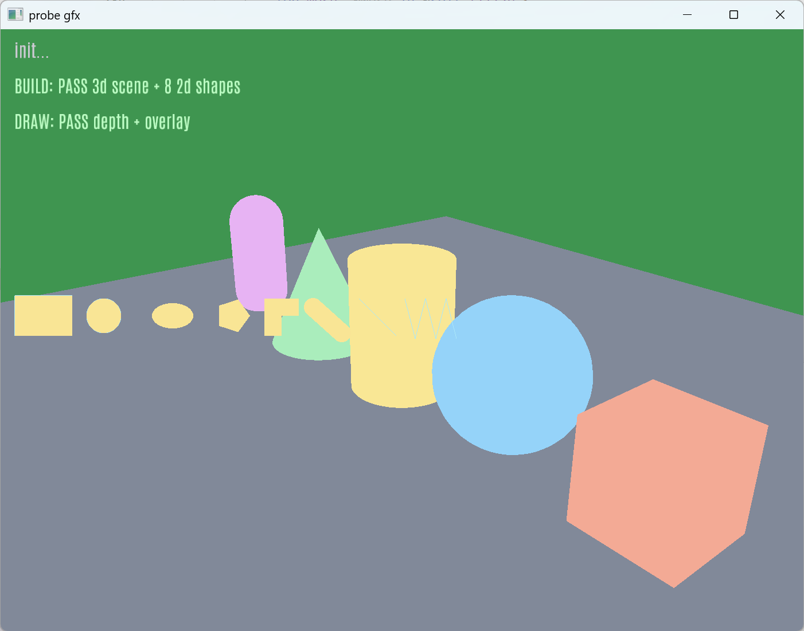
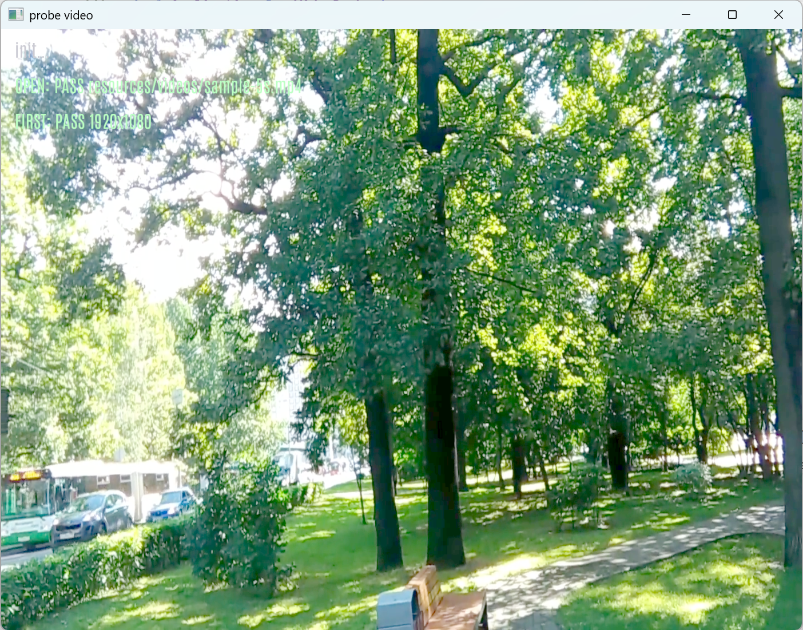
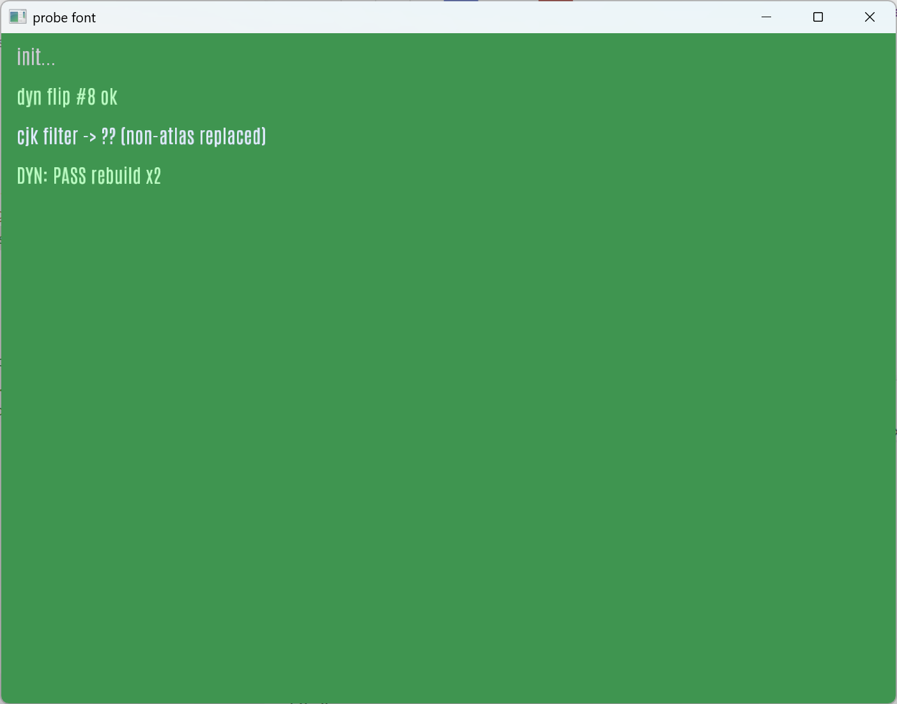
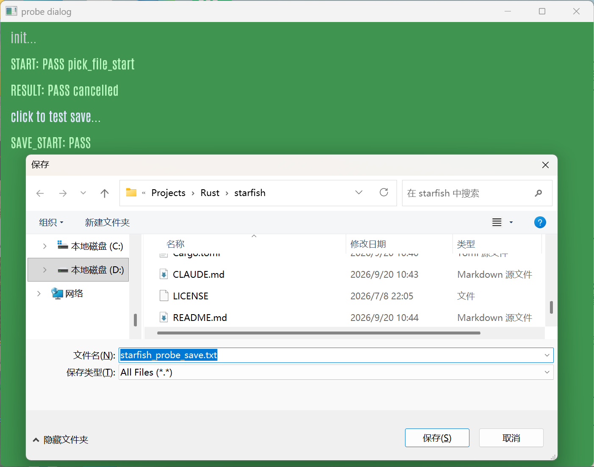

# ⭐ Starfish Game Lib

> **基于 wgpu + winit + cpal 的跨平台游戏库**
> 致力于打造次世代pygame！\
> 服务于python 图形化原型开发者,简单而不失细节！\
> 以「标准渲染对象 + 开发者持有数据」的底层封装为特色。

[](https://www.rust-lang.org)
[](https://wgpu.rs/)
[](https://winit.rs/)
[](https://github.com/RustAudio/cpal)

> SDL3 已于 2026-09-08 全量退役：窗口/事件 → winit，音频设备 → cpal，时间 → std::time。

---

## 📸 截图

示例即测试：`examples/probe/` 探针家族一套源码零 `#[cfg]` 跑全平台，
状态面板实时显示 PASS / SKIP / FAIL 判定。

<table>
  <tr>
    <td></td>
    <td></td>
  </tr>
  <tr>
    <td align="center">probe_gfx — 3D 深度场景 + 2D 全形状叠层</td>
    <td align="center">probe_video — 视频硬解全屏播放（含 AAC 音轨）</td>
  </tr>
  <tr>
    <td></td>
    <td></td>
  </tr>
  <tr>
    <td align="center">probe_font — 字体图集 + 动态文本重建</td>
    <td align="center">probe_dialog — 原生文件选择/保存对话框</td>
  </tr>
</table>

---

## 🖼️ 第三方美术资源
素材取自 LearnOpenGL
作者 Joey de Vries
来源：https://learnopengl.com
许可协议：Creative Commons Attribution 4.0 International (CC BY 4.0)

素材取自 SampleLib
来源：https://samplelib.com/zh/
许可说明：网站原创测试文件，无许可限制，允许下载、修改、使用；素材按现状提供，不提供担保。

---

## ✨ 特性

### 🚀 统一入口（一套源码，全平台）

- **`app_entry!` 一行宏**：桌面 / Web / Android 同一份应用代码，零平台 `#[cfg]`——
  `starfish::app_entry!(App::new(), WindowConfig::new(..))` 覆盖全部入口样板
  （Android 的 `android_main` / wasm 的启动属性自动生成）
- **引擎持循环**：`Application` 三回调（start / event / frame），
  桌面 Poll、Web Wait+rAF 双节流策略；窗口关闭 = 应用退出
- **键鼠状态表**：`ctx.keyboard().is_pressed(..)` 轮询 + 事件双轨（对齐 pygame）

### 🎨 渲染系统（wgpu 30）

- **特性能力系统**：三层选型许愿（core / recommended / special）+ 硬件掩码——
  设备创建**永不因愿望失败**，`RenderContext::features()` 运行时自查
- **管线全家桶**：深度模式（Standard / Reverse Z / Disabled）、混合
  （Opaque / Alpha / Additive / Multiply / Custom）、MSAA（表面级自动 resolve）、
  面剔除、线框、Stencil、Depth Bias、多边形填充模式
- **纹理全维度**：1D / 2D / 3D / Cube / Array，mipmap 策略可控，
  `write_texture` 局部更新（字体图集 / 视频帧）
- **绑定数组（bindless 地基）**：单批次多纹理，配 `recommended_limits()` 上限愿望
- **查询**：时间戳 / 遮挡查询集创建、解析与回读（profiler 地基）
- **Uniform + Storage Buffer**：StructLayout 自动对齐、dirty 跟踪、实时更新
- **Compute Pipeline**：计算着色器管线 + dispatch

### 🎬 视频硬解（feature = "video"；六平台）

- **平台全矩阵**：Windows(MF) / Ubuntu(GStreamer) / macOS·iOS(VideoToolbox) /
  Web(WebCodecs) / Android(MediaCodec)——各用系统硬解框架，**零软解兜底**
  （无硬解直接报 `NoHardwareDecoder`）
- **音轨直挂**（2026-09-20）：`open_with_audio(path, voice)` 把 AAC 音轨
  （symphonia 解码，全平台同一份代码）推入 mixer 流式声部——画面各平台硬解、
  音频统一软解，`set_audio_volume` / `set_muted` 直通声部
- **非侵入式手动泵**：`video.update(dt)` 推进解码到主时钟；追帧只上传最新帧，
  帧回调永不长阻塞；音轨背压满即停推，不阻塞帧
- **直绑渲染**：NV12→RGBA 整数定点转换上传纹理，`texture_view()` 接入
  `BindGroupBuilder` —— 装配一次管到底
- 格式承诺收敛：仅 H.264/MP4（各平台统一的最通用格式）

### 🔊 音频系统

- **AudioMixer**：多声道混音、通道分组总线、保留通道、音效效果器链
  （`AudioEffect` trait，任意 DSP 自定义）
- **三类声源分工**：SFX（整段缓冲，`play_with` 池化声道隐式回收）/
  流式声部（`open_stream_voice` 推式 PCM，环形缓冲背压反压推方，显式
  三段式生命周期，典型客户 = 视频音轨/程序化合成/网络流）/
  music（文件驱动流，解码线程自动维持缓冲，排队切歌 / seek / 淡入淡出）
- **流式重采样**：源采样率 ≠ 设备混音域时线性插值适配
  （整段 `resample` + 流式 `StreamResampler` 同款算法）
- **录音**：环形缓冲采集、溢出计数、WAV 导出（16-bit PCM）
- **格式**：OGG / MP3 / FLAC / WAV / AAC 自动探测（symphonia 纯 Rust）
- **单声道省内存**：单声道源只存一份，混音时展开

### 🎮 手柄输入（feature = "gamepad"）

- **状态表轮询**（对齐键鼠模式）：`ctx.gamepad().is_pressed / just_pressed / axis`
- gilrs 桌面三平台 + Web 自持 Gamepad API 轮询；热插拔即时反映

### 🔤 字体系统（feature = "font"；游戏内文本）

- **自研扫描线光栅化**：非零环绕 + 4×4 超采样抗锯齿，纯 Rust 零新增依赖
- **图集流水线**：字符集 → shelf 打包 → RGBA8 图集上传
- **kern 字距**：字距表解析，排版间距收紧
- **pos3 顶点**：一套布局同时服务 2D（z=0）与 3D（世界坐标 + 深度变体管线）
- **标准 Mesh 对接**：产出的就是引擎 `Mesh`，任意管线直接绘制

### 📐 几何绘制（feature = "gfx"）

- **16 种 2D/3D 形状**：矩形（填充/描边）、圆、椭圆、正多边形、
  **任意多边形（耳切三角化，凹多边形支持）**、线段/折线、胶囊 2D、
  立方体、UV 球、平面、圆柱、圆锥、胶囊 3D
- **形状参数 = 物理碰撞原语**：AABB / OBB / Sphere / Capsule / Cylinder / Plane
- **矩阵变换**：`Geometry::transformed(&Mat4)` 平移/旋转/缩放
- 填充（TriangleList）与描边（LineList）双管线

### 🪟 窗口系统（winit）

- **引擎持循环**：`run(app, WindowConfig)` 唯一入口，`Application` 三回调
  （start / event / frame）；桌面 Poll、Web Wait+rAF 双节流策略
- **平台中立事件模型**：自有 `WindowEvent` / `KeyCode` / `MouseButton` 枚举，
  后端（winit）翻译——应用代码不见平台类型
- 全屏、无边框、窗口模式切换
- 鼠标锁定、相对模式（FPS 相机）、高 DPI 支持
- **交换链自愈**：尺寸竞态免疫（Web 初始 0×0 场景从顺序上消除）

### 💬 对话框（feature = "dialog"）

- **三平台一套 API**：桌面 rfd 原生对话框 / Web 文件选择读入内存 +
  Blob 下载保存 / 移动端系统文件选择器（SAF / DocumentPicker）——
  应用代码零 `#[cfg]`
- **双形态**：异步 `pick_file` / `save_bytes`，或轮询式 Job
  （`pick_file_start` / `save_bytes_start` + `try_result`）——每帧问一次
  即刻返回，游戏循环零阻塞零卡顿
- **PickedFile 直读**：`name()` + `read()`，选择的文件统一进内存消费；
  用户取消 = `Ok(None)`，失败显式 `DialogError`

### 🌐 网络（feature = "net"）

- **TCP 消息连接** `TcpConn`：`connect` / `send` / `try_recv`——消息语义、
  非阻塞轮询，对齐游戏循环（不用 await 穿透帧逻辑）
- **UDP** `UdpSock`：`bind` / `send_to` / `try_recv_from` / `set_broadcast`
- **`Connection` trait 统一接口**：后台线程直连收发，控制面轮询——
  **零 tokio**，不往依赖树里拽异步运行时
- Web：TCP 语义映射 WebSocket；浏览器无 UDP → `UdpSock::bind` 返回 Err
  （能力缺失显式可测，探针判 SKIP 非 FAIL）

### 💾 文件 IO（feature = "io"）

- **统一异步五件套**：`read` / `write` / `exists` / `read_text` / `write_text`
  ——原生 std::fs 直实现，Web fetch 直实现（GET 读 / POST 保存，path 即 URL）
- **`set_base_dir` 全平台对称**：原生 = 目录拼接（Android 由引擎 `run` 自动
  注入应用私有目录），Web = URL 前缀（资源挂子路径 / 资产走 CDN 跨源前缀）；
  `/` 开头 = 绝对语义不受影响；`base_dir()` / `clear_base_dir()` 查询复位
- 未设置基准时保持各平台默认语义（桌面 CWD / 浏览器相对路径），行为可预期

### 🔐 权限与诊断（恒参与，非特性）

- **`permission::ensure(Permission)`**：枚举声明式权限申请，全平台同一签名
  ——Android = JNI 受控阻塞弹框，权限字符串内部翻译（调用方永不见
  `android.permission.*`）；桌面/Web 瞬时通过（Web 为委派语义：授权发生在
  紧随其后的系统 API）
- **隐式申请**：需要权限的模块在自己的构造路径上自动申请
  （`AudioRecorder` 内置麦克风申请），应用侧零感知零 cfg；需要精确控制
  时序的应用仍可显式调用
- **`debug::console_log`**：跨平台日志（桌面 stdout / wasm console.log）
  ——无头测试的判读锚点通道
- **`debug::assert_main_thread`**：主线程契约守卫——跨线程误用 debug
  构建立即 panic 指明现场，release 零成本；wasm panic hook 自动转发崩溃
  到浏览器控制台

### ⏱️ 时间系统（std::time）

- `Clock`：raw / scaled delta 分离（暂停、慢动作）、f64 总时长、EMA 平滑帧率
- `FixedTimestep`：确定性玩法更新，死循环保护
- `sleep_until`：混合节流（睡眠 + 末段自旋，亚毫秒精度）；wasm 上为 no-op
  （Web 节流权归浏览器 rAF）

### 🧩 特性裁剪（Cargo features）

默认 `["gfx", "font", "video", "gamepad", "dialog", "net", "io"]` 全包含，
开箱即用；不需要的场景可剔除（渲染/窗口/循环/时间/audio 恒参与）：

| 特性 | 剔除的模块 | 备注 |
|---|---|---|
| `gfx` | 几何绘制 | 自管几何 |
| `font` | 字体 | 无文本渲染 |
| `video` | 视频硬解 | **剔除后 Linux 构建不再要求 gstreamer dev 系统包** |
| `gamepad` | 手柄 | Web 自持轮询不受影响 |
| `dialog` | 对话框 | Android 构建同时免去 ANDROID_JAR 要求 |
| `net` | 网络 | Web WebSocket 依赖随之剔除 |
| `io` | 文件 IO | 桌面 std::fs 直用不受影响 |

---

## 🗂️ 项目结构

```
starfish/
├── Cargo.toml              # 依赖与特性配置
├── examples/
│   ├── probe/              # ⭐ 探针家族（window/font/gfx/audio/record/video/
│   │                       #   gamepad/dialog/net/io + 共享 kit.rs）——
│   │                       #   一套源码零 cfg 跑全平台的应用代码 + 判读锚点
│   └── server/             # 探针对端服务器（TCP/UDP/WS echo + 静态部署）
├── resources/              # 资源文件（纹理、着色器、字体、音频、视频）
├── doc/log/                # 更新日志（按日归档，含架构决策）
├── reference/              # 设计笔记（wasm 编译运行指南、Android 构建指南等）
└── src/
    ├── lib.rs              # app_entry! 统一入口宏（全平台一行）
    ├── base/               # ⚙️ 底层封装（可脱离 pygame 思维直用）
    │   ├── app.rs          #   循环模型（引擎持循环 + Application 三回调 + Ctx）
    │   ├── render/         #   渲染系统（管线/绑定/网格/纹理/Pass/特性系统）
    │   ├── gfx/            #   几何绘制（feature = "gfx"）
    │   ├── font/           #   字体（feature = "font"）
    │   ├── audio/          #   音频（混音器/SFX/流式声部/流式 BGM/录音/解码器/重采样）
    │   ├── video/          #   视频硬解 + 音轨泵（feature = "video"；
    │   │                   #   windows/linux/apple/web/android 后端 + mp4_demux）
    │   ├── gamepad.rs      #   手柄状态表（feature = "gamepad"）
    │   ├── dialog.rs       #   统一异步对话框（feature = "dialog"）
    │   ├── net.rs          #   网络 TCP 消息 + UDP（feature = "net"）
    │   ├── io.rs           #   文件读写（feature = "io"；原生 std::fs / Web fetch）
    │   ├── permission.rs   #   权限申请（枚举声明式；模块构造时隐式调用）
    │   ├── debug/          #   开发者诊断（console_log / panic hook / 线程契约守卫）
    │   ├── yuv.rs          #   NV12 → RGBA 转换共享层（video 系）
    │   ├── time/           #   时间（Clock/FixedTimestep/节流）
    │   ├── window/         #   窗口封装 + 事件模型（WindowEvent/键鼠状态表）
    │   ├── color.rs        #   HDR 浮点颜色
    │   └── error.rs        #   错误类型
    └── pygame/             # 🐍 pygame 风格接口（Color / Rect）
```

---

## 🚀 快速开始

### 环境要求

- Rust 1.85+
- 支持 Vulkan / Metal / DX12 的显卡
- Linux 视频功能需 `libgstreamer1.0-dev` 等系统包（不启用 `video` 特性则无需）

### Hello Starfish

```rust
use starfish::base::app::{Application, Ctx, WindowConfig};

struct App;

impl Application for App {
    // start / event 有空默认实现，按需覆写
    fn frame(&mut self, _ctx: &mut Ctx) {
        // 每帧：更新 + 渲染；窗口关闭（点 ×）= 应用退出
    }
}

// 一行覆盖桌面 / Web / Android 三平台入口（android_main 与 wasm 启动自动生成）
starfish::app_entry!(App, WindowConfig::new("Hello Starfish", 800, 600));
```

### 运行探针示例

```bash
# 模块探针（一套源码零 cfg 跑桌面 / Web / Android）
cargo run --example probe_window    # 窗口/循环/输入 + 诊断面板
cargo run --example probe_gfx       # 3D 深度场景 + 2D 全形状叠层
cargo run --example probe_font      # 字体图集 + 动态文本
cargo run --example probe_audio     # 音效解码播放
cargo run --example probe_record    # 录音 → WAV（权限隐式申请）
cargo run --example probe_video     # 视频硬解 + AAC 音轨全屏播放（自动退出）
cargo run --example probe_dialog    # 文件选择/保存（轮询式）
cargo run --example probe_gamepad   # 手柄状态表上屏
cargo run --example probe_io        # 数据读写往返（Web 走 fetch）
cargo run --example probe_net       # TCP/UDP echo（Web 走 WebSocket）

# probe_io / probe_net 的对端 + Web 静态部署
python examples/server/server.py --web-dir ./web

# Web 构建（以 probe_gfx 为例；完整指南见 reference/wasm编译与运行指南.md）
cargo build --release --target wasm32-unknown-unknown --example probe_gfx
wasm-bindgen --out-dir web --target web \
  target/wasm32-unknown-unknown/release/examples/probe_gfx.wasm

# Android 出包（完整指南见 reference/android构建与运行指南.md）
cargo xtask android probe_gfx --build
```

### 在自己的项目中使用

```toml
[dependencies]
starfish = { git = "https://github.com/GuYeying/starfish" }
# 场景化裁剪（示例：不需要视频与手柄）
starfish = { git = "https://github.com/GuYeying/starfish", default-features = false, features = ["gfx", "font"] }
```

---

## 📚 示例详解（probe 探针家族）

| 探针 | 展示内容 | 关键 API |
|------|---------|----------|
| probe_window | 窗口/循环/输入/尺寸自愈 + 诊断面板 | `Application`, `Ctx`, `InitSlot` |
| probe_font | 字体图集 + 文本热更新 | `Font::from_bytes`, `build_atlas`, `text_mesh_tf` |
| probe_gfx | 3D 深度场景 + 2D 全形状叠层 | `gfx::shape_mesh`, `fill_pipeline_3d`, 环绕相机 |
| probe_audio | 音效解码 + 混音播放 | `SymphoniaReader`, `AudioMixer`, `play_with` |
| probe_record | 麦克风录音 → WAV（权限隐式申请） | `AudioRecorder`, `permission::ensure` |
| probe_video | 视频硬解 + AAC 音轨全屏播放（六平台同一链路） | `VideoModule::open_with_audio`, `video.update(dt)`, `StreamVoice` |
| probe_gamepad | 手柄状态表轮询上屏 | `ctx.gamepad()`, `is_pressed`, `axis` |
| probe_dialog | 文件选择/保存（轮询式 Job） | `pick_file_start`, `try_result`, `save_bytes_start` |
| probe_net | TCP/UDP echo（Web 走 WebSocket） | `TcpConn`, `UdpSock`, `ConnState` |
| probe_io | 数据读写往返（Web 走 fetch） | `io::write/read/exists/read_text/write_text` |

共享 harness：`examples/probe/kit.rs`（状态面板 / PASS·SKIP·FAIL 三态判定 /
平台感知资源路径）；判读锚点 = 控制台 `[probe] TAG PASS|SKIP|FAIL`，
无头环境可自动化收割。

---

## 🛠️ 技术栈

| 组件 | 技术 | 版本 |
|------|------|------|
| 图形 API | [wgpu](https://wgpu.rs/) | 30.0 |
| 窗口/事件 | [winit](https://winit.rs/) | 0.30 |
| 音频设备 | [cpal](https://github.com/RustAudio/cpal) | 0.18 |
| 手柄 | [gilrs](https://docs.rs/gilrs/)（win/linux/mac） | 0.11 |
| 视频硬解 | MF / GStreamer / VideoToolbox / WebCodecs / MediaCodec | 系统框架 |
| MP4 解复用 | [mp4](https://docs.rs/mp4/)（纯 Rust） | 0.14 |
| 数学 | [glam](https://docs.rs/glam/) | 0.33 |
| 字体解析 | [ttf-parser](https://docs.rs/ttf-parser/) | 0.25 |
| 音频解码 | [symphonia](https://docs.rs/symphonia/)（OGG/MP3/FLAC/WAV/AAC） | 0.5 |
| 纹理加载 | [image](https://docs.rs/image/) | 0.25 |
| 序列化 | [serde](https://serde.rs/) + [serde_json](https://docs.rs/serde_json/) | 1.0 |
| 错误处理 | [thiserror](https://docs.rs/thiserror/) | 2.0 |
| 内存映射 | [bytemuck](https://docs.rs/bytemuck/) | 1.23 |

---

## 🧪 跨平台进度与测试

> 2026-09-20 更新。状态含义：✅ 已验证可用 · ⚠️ 可用但受限 · ⏳ 待验证（实现就绪，未实测）· ❌ 明确不支持

### 模块 × 平台矩阵

| 模块 | Windows | Linux | macOS | Web | Android（arm64） | 鸿蒙 NEXT（卓易通） |
|---|:-:|:-:|:-:|:-:|:-:|:-:|
| 渲染系统 | ✅ | ✅ | ⏳ | ✅ | ✅ | ✅ |
| 窗口 / 循环模型 | ✅ | ✅ | ⏳ | ✅ | ✅ | ✅ |
| 键鼠 / 触摸输入 | ✅ | ✅ | ⏳ | ✅ | ✅ | ✅ |
| 音频播放（混音/流式） | ✅ | ✅ | ⏳ | ✅ | ✅ | ✅ |
| 录音 | ✅ | ✅ | ⏳ | ✅ | ✅ | ✅ |
| 字体（图集文本） | ✅ | ✅ | ⏳ | ✅ | ✅ | ✅ |
| 几何绘制（gfx） | ✅ | ✅ | ⏳ | ✅ | ✅ | ✅ |
| 视频硬解 | ✅ MF | ⏳ GStreamer | ⏳ VideoToolbox | ✅ WebCodecs | ✅ MediaCodec | ✅ MediaCodec |
| 视频音轨（symphonia AAC） | ✅ | ⏳ | ⏳ | ✅ | ✅ | ✅ |
| 手柄 | ✅ gilrs | ✅ gilrs | ⏳ gilrs | ✅ Gamepad API | ❌ 空实现占位 | ❌ 空实现占位 |
| 对话框（文件选择/保存） | ✅ rfd | ⏳ rfd(GTK3) | ⏳ rfd | ✅ input[file] | ✅ | ✅ |
| 网络（TCP / UDP） | ✅ | ⏳ | ⏳ | ⚠️ WS ✅ 实测 / UDP ❌ | ✅ 实测 | ✅ 实测 |
| 文件读取 / 保存（io） | ✅ std::fs | ✅ std::fs | ⏳ std::fs | ✅ fetch | ✅ std::fs | ✅ std::fs |
| 构建工具（APK 出包） | — | — | — | — | ✅ xtask 一键 | ✅ 卓易通直装 |

> Android / 鸿蒙列的验证环境 = **卓易通容器**（鸿蒙 NEXT，原生 arm64 Android 运行时）；
> 渲染/循环/触摸/返回退出均为实机确认，标准 Android 真机预期等同或更好。

### 自动化测试

| 项目 | 结果 |
|---|---|
| `cargo test --lib`（纯逻辑测试） | **64 passed / 0 failed** |
| `cargo check --examples`（probe 家族 20 条注册） | ✅ 零 error |
| 四目标 lib check（桌面 / Android / iOS / wasm） | ✅ 零 error |
| probe 10 件 Web 构建 + 无头判读（console 锚点全 PASS） | ✅ |
| probe 家族 Android APK 出包（io/dialog/gfx/video 等，含签名校验） | ✅ |

### 构建工具

```bash
cargo xtask list                              # 全部示例 + Android 支持注册表
cargo xtask android probe_io                  # 编译→打包→签名→部署 一键完成
cargo xtask android probe_video --build       # 仅构建出 APK，不装机
cargo xtask android probe_window --abi x86_64                      # 模拟器 ABI
cargo xtask android probe_dialog --orientation portrait            # 横竖屏可选
cargo xtask android probe_gfx --no-default-features --features dialog,gfx   # 特性勾选
```

---

## 🗺️ 开发路线图

> 依据 `doc/log/` 批次记录（2026-09-08 ~ 09-20）与 `doc/starfish_开发进度记录.md` 整理。

### ✅ 已完成

| 里程碑 | 完成时间 |
|---|---|
| **Phase 1** · 原生底层底座（渲染系统 / 音频混音 / 窗口 / 循环模型） | 2026-09 上旬 |
| **Phase 2** · 资源体系（图片/着色器/音频解码）+ 几何生成器（16 种 2D/3D 形状） | 2026-09 上旬 |
| **SDL3 全量退役 → winit + cpal + std::time 平台迁移** | 2026-09-08 |
| **视频六平台硬解**（Windows MF / Ubuntu GStreamer / macOS·iOS VideoToolbox / Web WebCodecs / Android MediaCodec；硬解唯一策略） | 2026-09-11 |
| **Cargo features 场景化裁剪**（gfx / font / video 可剔除，默认全包含） | 2026-09-11 |
| **设备接口 · 手柄**（gilrs 桌面三平台 + Web 自持轮询；Android/iOS 空占位） | 2026-09-11 |
| **文档体系**（视频跨平台架构笔记 / 开发进度活文档 / 示例分类目录化） | 2026-09-12 |
| **Android 全链路打通**：NativeActivity 无 Java 模板 + 同源双注册示例 + 卓易通（鸿蒙 NEXT）实机验证（渲染/循环/返回退出/纹理/3D）+ 引擎级修复（view_formats 掩码 / 启动门句柄探测 / draw 索引路由） | 2026-09-17 |
| **xtask 构建工具**：`cargo xtask android <示例>` 一键出包（特性勾选 / 横竖屏 / ABI 可选 / dex 自动并入） | 2026-09-17 |
| **系统能力模块**：dialog（统一异步对话框）/ net（TCP+UDP，零 tokio）/ io（统一读写，Web fetch） | 2026-09-18 |
| **permission（隐式权限申请）+ debug（诊断设施归一）** | 2026-09-19 |
| **probe 探针家族 + `app_entry!` 统一入口**：一套源码零 cfg 跑全平台（应用代码无条件编译，平台差异收敛于宏 / kit / 库 API 三消化点）；旧学习路线示例退役 | 2026-09-19 |
| **视频音轨**：`open_with_audio` + mp4_demux 音轨提取 + symphonia AAC（全平台同一软解链路）+ 流式线性插值重采样 | 2026-09-20 |

### 🚧 进行中

- **设备实机验证清单**：Linux(GStreamer) / macOS(VideoToolbox) 视频路为类型级验证，
  按 `doc/starfish_开发进度记录.md` 清单逐台过；视频音轨的 Android 实机
  （卓易通）部署待执行（APK 已出包）
- **video v2 体验优化**：NV12→GPU 采样着色器转换（CPU 转换成本归零）、
  Web 字节范围流式加载、④ A/V 精确同步（v1 = 视频时钟近似同步）

### 📋 下一步

- **Phase 3 · 接口文档**：reference/ 设计笔记体系已起步（wasm / Android 指南、
  视频跨平台架构笔记已就位），持续补全各模块文档，让开发者和 AI 更容易了解该库
- **Phase 4 · Pygame 风格高层 API**：窗口、事件、图像、字体、音频、时间等通用接口封装
- **设备接口第二批（已取消）**：摄像头/GPS——评估结论：与硬件/系统强绑定的
  能力，跨平台抽象层不如针对目标平台直调 API；此类需求出现时按平台直采
- **Phase 5 · RustPython&CPython 双路线绑定**：面向 free-threaded Python 3.14t 契约，分批导出
  窗口、纹理、网格、音频等核心能力
- **Phase 6 · pygame 规范接口文档**：对齐规范、注明与 pygame 的细致差异
- **Phase 7 · CI 与分发**：自动打包、多平台 wheel、pip install 一键安装
- **Phase 8 · 鸿蒙后端**：窗口、输入、音频、图形全链路适配

### ⛔ 阻塞项（前置依赖）

- ~~**引擎安卓引导立项**（android-activity + gradle 模板 + ndk_context 注入）~~
  **已解除（2026-09-17）**：android-activity 引导 + NativeActivity 模板 +
  xtask 一键打包已落地（无需 gradle），Android 实机验证通道全面打开
- ~~GPS / 摄像头~~：已取消（见设备接口第二批条目）

---

#### 星

---

## 📄 许可证

Apache License 2.0 © 2025 Starfish Lib Authors
