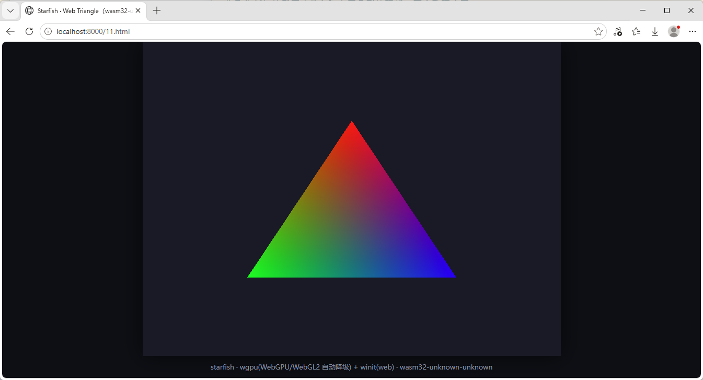
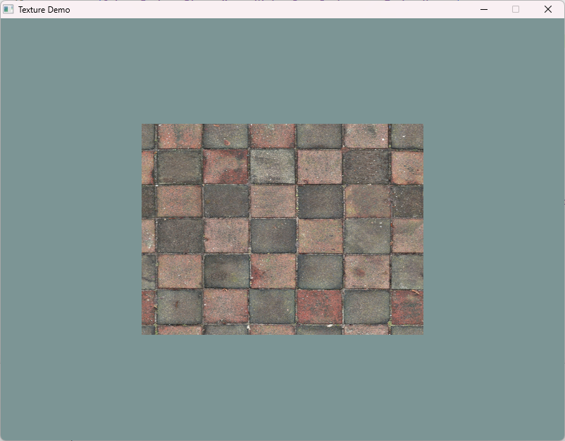
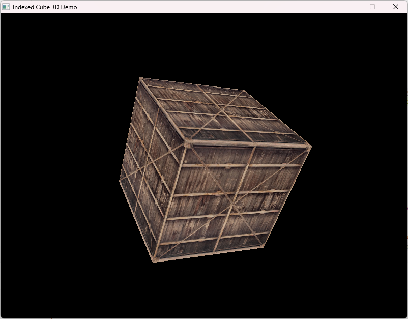
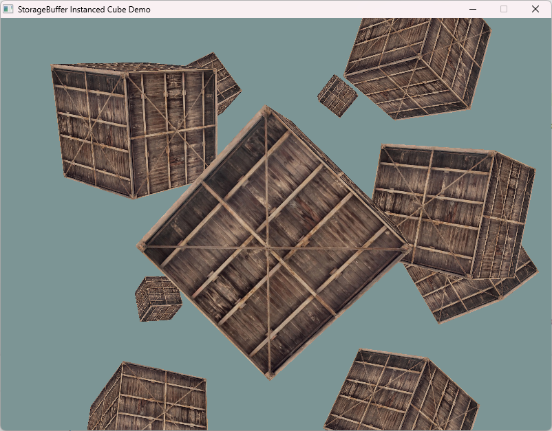
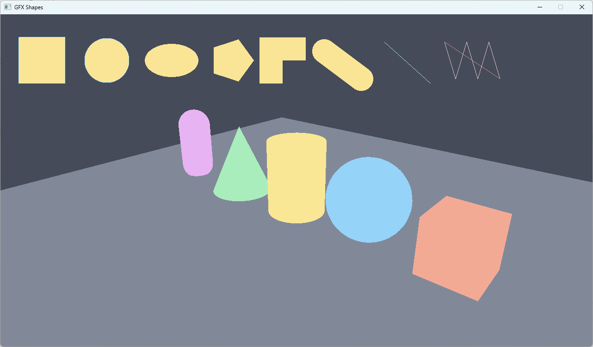
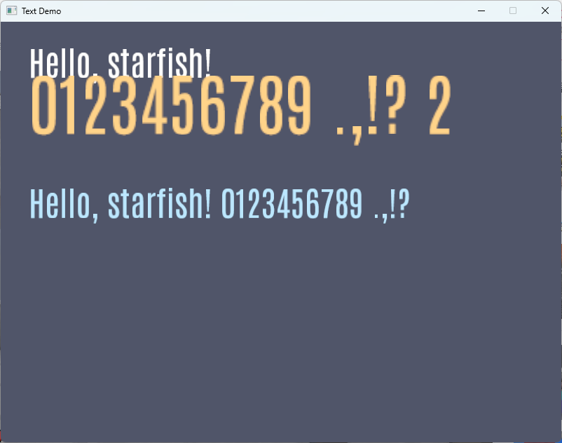
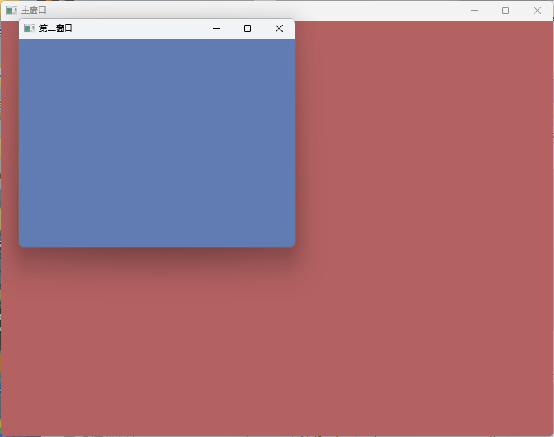
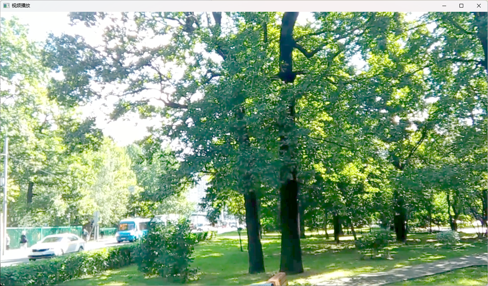

# ⭐ Starfish Game Lib

> **基于 wgpu + winit + cpal 的跨平台游戏库**
> 致力于打造次世代pygame！\
> 服务于python 图形化原型开发者,简单而不失细节！\
> 以「标准渲染对象 + 开发者持有数据」的底层封装为特色。

[](https://www.rust-lang.org)
[](https://wgpu.rs/)
[](https://winit.rs/)
[](https://github.com/RustAudio/cpal)

> SDL3 已于 2026-09-08 全量退役：窗口/事件 → winit，音频设备 → cpal，时间 → std::time。

---

## 📸 截图

<table>
  <tr>
    <td></td>
    <td></td>
  </tr>
  <tr>
    <td align="center">11_web_triangles — Web 三角形（wgpu 双后端）</td>
    <td align="center">03_texture — 纹理贴图</td>
  </tr>
  <tr>
    <td></td>
    <td></td>
  </tr>
  <tr>
    <td align="center">04_coord_system — MVP 旋转立方体</td>
    <td align="center">05_storage_cube — 实例化渲染 + FPS 相机</td>
  </tr>
  <tr>
    <td></td>
    <td></td>
  </tr>
  <tr>
    <td align="center">06_draw_gfx — 全形状几何绘制（2D/3D）</td>
    <td align="center">07_draw_text — 字体图集文本渲染</td>
  </tr>
  <tr>
    <td></td>
    <td></td>
  </tr>
  <tr>
    <td align="center">12_multi_window — 运行时多窗口</td>
    <td align="center">13_video_decode — 视频硬解播放（六平台）</td>
  </tr>
</table>

---

## 🖼️ 第三方美术资源
素材取自 LearnOpenGL
作者 Joey de Vries
来源：https://learnopengl.com
许可协议：Creative Commons Attribution 4.0 International (CC BY 4.0)

素材取自 SampleLib
来源：https://samplelib.com/zh/
许可说明：网站原创测试文件，无许可限制，允许下载、修改、使用；素材按现状提供，不提供担保。

---

## ✨ 特性

### 🎨 渲染系统（wgpu 30）

- **特性能力系统**：三层选型许愿（core / recommended / special）+ 硬件掩码——
  设备创建**永不因愿望失败**，`RenderContext::features()` 运行时自查
- **管线全家桶**：深度模式（Standard / Reverse Z / Disabled）、混合
  （Opaque / Alpha / Additive / Multiply / Custom）、MSAA（表面级自动 resolve）、
  面剔除、线框、Stencil、Depth Bias、多边形填充模式
- **纹理全维度**：1D / 2D / 3D / Cube / Array，mipmap 策略可控，
  `write_texture` 局部更新（字体图集 / 视频帧）
- **绑定数组（bindless 地基）**：单批次多纹理，配 `recommended_limits()` 上限愿望
- **查询**：时间戳 / 遮挡查询集创建、解析与回读（profiler 地基）
- **Uniform + Storage Buffer**：StructLayout 自动对齐、dirty 跟踪、实时更新
- **Compute Pipeline**：计算着色器管线 + dispatch
- **多窗口**：运行时 `ctx.create_window(cfg)` 创建（InitSlot 惰性物化），
  `surface_from_context` 共享设备；事件按窗路由

### 🎬 视频硬解（六平台）

- **平台全矩阵**：Windows(MF) / Ubuntu(GStreamer) / macOS·iOS(VideoToolbox) /
  Web(WebCodecs) / Android(MediaCodec)——各用系统硬解框架，**零软解兜底**
  （无硬解直接报 `NoHardwareDecoder`）
- **非侵入式手动泵**：`video.update(dt)` 推进解码到主时钟；追帧只上传最新帧，
  帧回调永不长阻塞
- **直绑渲染**：NV12→RGBA 整数定点转换上传纹理，`texture_view()` 接入
  `BindGroupBuilder` —— 装配一次管到底
- 格式承诺收敛：仅 H.264/MP4（各平台统一的最通用格式）

### 🎮 手柄输入

- **状态表轮询**（对齐键鼠模式）：`ctx.gamepad().is_pressed / just_pressed / axis`
- gilrs 桌面三平台 + Web 自持 Gamepad API 轮询；热插拔即时反映

### 🔤 字体系统（游戏内文本）

- **自研扫描线光栅化**：非零环绕 + 4×4 超采样抗锯齿，纯 Rust 零新增依赖
- **图集流水线**：字符集 → shelf 打包 → RGBA8 图集上传
- **kern 字距**：字距表解析，排版间距收紧
- **pos3 顶点**：一套布局同时服务 2D（z=0）与 3D（世界坐标 + 深度变体管线）
- **标准 Mesh 对接**：产出的就是引擎 `Mesh`，任意管线直接绘制

### 📐 几何绘制（gfx）

- **16 种 2D/3D 形状**：矩形（填充/描边）、圆、椭圆、正多边形、
  **任意多边形（耳切三角化，凹多边形支持）**、线段/折线、胶囊 2D、
  立方体、UV 球、平面、圆柱、圆锥、胶囊 3D
- **形状参数 = 物理碰撞原语**：AABB / OBB / Sphere / Capsule / Cylinder / Plane
- **矩阵变换**：`Geometry::transformed(&Mat4)` 平移/旋转/缩放
- 填充（TriangleList）与描边（LineList）双管线

### 🔊 音频系统

- **AudioMixer**：多声道混音、通道分组总线、保留通道、音效效果器链
  （`AudioEffect` trait，任意 DSP 自定义）
- **流式 BGM**：cpal 回调 + 解码线程 + SPSC 环形缓冲——长音频内存恒定，
  排队切歌、seek、淡入淡出
- **录音**：环形缓冲采集、溢出计数、WAV 导出（16-bit PCM）
- **格式**：OGG / MP3 / FLAC / WAV 自动探测（symphonia 纯 Rust）
- **单声道省内存**：单声道源只存一份，混音时展开

### ⏱️ 时间系统（std::time）

- `Clock`：raw / scaled delta 分离（暂停、慢动作）、f64 总时长、EMA 平滑帧率
- `FixedTimestep`：确定性玩法更新，死循环保护
- `sleep_until`：混合节流（睡眠 + 末段自旋，亚毫秒精度）；wasm 上为 no-op
  （Web 节流权归浏览器 rAF）

### 🪟 窗口系统（winit）

- **引擎持循环**：`run(app, WindowConfig)` 唯一入口，`Application` 三回调
  （start / event / frame）；桌面 Poll、Web Wait+rAF 双节流策略
- 全屏、无边框、窗口模式切换；多窗口运行时创建
- 鼠标锁定、相对模式（FPS 相机）、高 DPI 支持
- **交换链自愈**：尺寸竞态免疫（Web 初始 0×0 场景从顺序上消除）

### 🧩 特性裁剪（Cargo features）

- 默认 `["gfx", "font", "video", "gamepad"]` 全包含，开箱即用
- 不需要的场景可剔除：`--no-default-features` 或按特性组合——
  **剔除 `video` 后 Linux 构建不再要求 gstreamer dev 系统包**

---

## 🗂️ 项目结构

```
starfish/
├── Cargo.toml              # 依赖与特性配置
├── examples/               # 示例程序（01 起按学习路线编号，按类分目录）
│   ├── basics/             #   入门与循环模型（01/02）
│   ├── render/             #   渲染进阶（03/04/05）
│   ├── draw/               #   几何与文本（06/07）
│   ├── audio/              #   音频（08/09/10）
│   ├── platform/           #   平台能力（11 Web / 12 多窗口）
│   └── media/              #   媒体与设备（13 视频 / 14 手柄）
├── resources/              # 资源文件（纹理、着色器、字体、音频、视频）
├── doc/log/                # 更新日志（按日归档）
├── reference/              # 设计笔记（视频跨平台架构、wasm 指南等）
└── src/
    ├── lib.rs              # web_entry! 宏
    ├── base/               # ⚙️ 底层封装（可脱离 pygame 思维直用）
    │   ├── app.rs          #   循环模型（引擎持循环 + Application 三回调 + Ctx）
    │   ├── render/         #   渲染系统（管线/绑定/网格/纹理/Pass/特性系统）
    │   ├── gfx/            #   几何绘制（feature = "gfx"）
    │   ├── font/           #   字体（feature = "font"）
    │   ├── audio/          #   音频（混音器/流式/录音/解码器）
    │   ├── video/          #   视频硬解（feature = "video"；windows/linux/apple/web/android 后端）
    │   ├── gamepad.rs      #   手柄状态表（feature = "gamepad"）
    │   ├── time/           #   时间（Clock/FixedTimestep/节流）
    │   ├── window/         #   窗口封装 + 事件模型（WindowEvent/键鼠状态表）
    │   ├── web.rs          #   Web 入口辅助（console_log / panic hook）
    │   ├── color.rs        #   HDR 浮点颜色
    │   └── error.rs        #   错误类型
    └── pygame/             # 🐍 pygame 风格接口（Color / Rect）
```

---

## 🚀 快速开始

### 环境要求

- Rust 1.85+
- 支持 Vulkan / Metal / DX12 的显卡
- Linux 视频功能需 `libgstreamer1.0-dev` 等系统包（不启用 `video` 特性则无需）

### 运行示例

```bash
# 最简示例：清屏
cargo run --example 01_hello_world

# 彩色三角形
cargo run --example 02_triangles

# 纹理贴图（需 resources/textures/wall.jpg）
cargo run --example 03_texture

# 3D MVP 旋转立方体（推荐：含手写 look_at/perspective）
cargo run --example 04_coord_system

# 实例化渲染 + FPS 相机（最完整的 3D 示例）
cargo run --example 05_storage_cube

# 全形状几何绘制（2D 填充/描边 + 3D 环绕相机）
cargo run --example 06_draw_gfx

# 字体图集文本渲染
cargo run --example 07_draw_text

# 音频：音效 + 流式 BGM + 效果器
cargo run --example 08_play_sound
cargo run --example 09_play_music_stream

# 录音（默认 5 秒，保存 recording.wav）
cargo run --example 10_record_mic

# 视频硬解播放（需 --features video；Windows MF / Ubuntu GStreamer / macOS VT）
cargo run --features video --example 13_video_decode

# 手柄输入状态可视化（需 --features gamepad；连接手柄）
cargo run --features gamepad --example 14_gamepad
```

### 在自己的项目中使用

```toml
[dependencies]
starfish = { git = "https://github.com/GuYeying/starfish" }
# 场景化裁剪（示例：不需要视频与手柄）
starfish = { git = "https://github.com/GuYeying/starfish", default-features = false, features = ["gfx", "font"] }
```

---

## 📚 示例详解

| 示例 | 展示内容 | 关键 API |
|------|---------|----------|
| 01_hello_world | 窗口创建 + 清屏 | `RenderEntry::new`, `begin_frame`, `present` |
| 02_triangles | 顶点数据 + 着色器 + 管线 + 绘制 | `ShaderModuleBuilder`, `MeshBuilder`, `RenderPipelineBuilder` |
| 03_texture | 纹理加载 + 采样器 + BindGroup | `create_texture`, `create_sampler`, `BindGroupBuilder` |
| 04_coord_system | MVP 矩阵 + 索引缓冲 + 3D 深度 | Uniform Buffer, `look_at`/`perspective`, `render_pipeline_builder_3d` |
| 05_storage_cube | 实例化渲染 + StorageBuffer + FPS 相机 | `StorageBuffer`, `draw_mesh_instanced`, 鼠标控制 |
| 06_draw_gfx | 2D 填充/描边 + 3D 深度遮挡 | `gfx::shape_mesh`, `fill_pipeline_2d/3d`, `Geometry::transformed` |
| 07_draw_text | 字体图集 + 文本 Mesh | `Font::from_file`, `build_atlas`, `text_mesh_tf`, `text_pipeline` |
| 08_play_sound | 混音器 + 效果器 + 淡入淡出 | `AudioMixer`, `SymphoniaDecoder`, `sfx_add_effect` |
| 09_play_music_stream | 流式 BGM + 排队切歌 | `music_load_file`, `music_queue_file`, `music_fade_*` |
| 10_record_mic | 麦克风录音 → WAV | `AudioRecorder::new`, `save_wav`, `dropped` |
| 11_web_triangles | Web(wasm32-unknown-unknown) 双后端 | `web_entry!`, `with_web_canvas_id` |
| 12_multi_window | 运行时多窗口 | `ctx.create_window`, `window_created/closed` |
| 13_video_decode | 视频硬解播放（六平台） | `VideoModule::open`, `video.update(dt)`, `texture_view` |
| 14_gamepad | 手柄状态轮询 | `ctx.gamepad()`, `is_pressed`, `just_pressed`, `axis` |

---

## 🛠️ 技术栈

| 组件 | 技术 | 版本 |
|------|------|------|
| 图形 API | [wgpu](https://wgpu.rs/) | 30.0 |
| 窗口/事件 | [winit](https://winit.rs/) | 0.30 |
| 音频设备 | [cpal](https://github.com/RustAudio/cpal) | 0.18 |
| 手柄 | [gilrs](https://docs.rs/gilrs/)（win/linux/mac） | 0.11 |
| 视频硬解 | MF / GStreamer / VideoToolbox / WebCodecs / MediaCodec | 系统框架 |
| MP4 解复用 | [mp4](https://docs.rs/mp4/)（纯 Rust） | 0.14 |
| 数学 | [glam](https://docs.rs/glam/) | 0.33 |
| 字体解析 | [ttf-parser](https://docs.rs/ttf-parser/) | 0.25 |
| 音频解码 | [symphonia](https://docs.rs/symphonia/) | 0.5 |
| 纹理加载 | [image](https://docs.rs/image/) | 0.25 |
| 序列化 | [serde](https://serde.rs/) + [serde_json](https://docs.rs/serde_json/) | 1.0 |
| 错误处理 | [thiserror](https://docs.rs/thiserror/) | 2.0 |
| 内存映射 | [bytemuck](https://docs.rs/bytemuck/) | 1.23 |

---

## 🗺️ 开发路线图

> 依据 `doc/log/` 批次记录（2026-09-08 ~ 09-12）与 `doc/starfish_开发进度记录.md` 整理。

### ✅ 已完成

| 里程碑 | 完成时间 |
|---|---|
| **Phase 1** · 原生底层底座（渲染系统 / 音频混音 / 窗口 / 循环模型） | 2026-09 上旬 |
| **Phase 2** · 资源体系（图片/着色器/音频解码）+ 几何生成器（16 种 2D/3D 形状） | 2026-09 上旬 |
| **SDL3 全量退役 → winit + cpal + std::time 平台迁移** | 2026-09-08 |
| **视频六平台硬解**（Windows MF / Ubuntu GStreamer / macOS·iOS VideoToolbox / Web WebCodecs / Android MediaCodec；硬解唯一策略） | 2026-09-11 |
| **Cargo features 场景化裁剪**（gfx / font / video 可剔除，默认全包含） | 2026-09-11 |
| **设备接口 · 手柄**（gilrs 桌面三平台 + Web 自持轮询；Android/iOS 空占位） | 2026-09-11 |
| **文档体系**（视频跨平台架构笔记 / 开发进度活文档 / 示例分类目录化） | 2026-09-12 |

### 🚧 进行中

- **设备实机验证清单**：Ubuntu(GStreamer) / macOS(VideoToolbox) / Web / Android 四路后端为
  类型级验证（盲写），按 `doc/starfish_开发进度记录.md` 清单逐台过
- **video v2 体验优化**：NV12→GPU 采样着色器转换（CPU 转换成本归零）、
  Web 字节范围流式加载、音轨注入（待 mixer 流声部 API）

### 📋 下一步

- **Phase 3 · 接口文档**：reference/ 设计笔记体系已起步（视频跨平台架构笔记已就位），
  持续补全各模块文档，让开发者和 AI 更容易了解该库
- **Phase 4 · Pygame 风格高层 API**：窗口、事件、图像、字体、音频、时间等通用接口封装
- **设备接口第二批（已取消）**：摄像头/GPS——评估结论：与硬件/系统强绑定的
  能力，跨平台抽象层不如针对目标平台直调 API；此类需求出现时按平台直采
- **Phase 5 · PyO3 分层绑定**：面向 free-threaded Python 3.14t 契约，分批导出
  窗口、纹理、网格、音频等核心能力
- **Phase 6 · pygame 规范接口文档**：对齐规范、注明与 pygame 的细致差异
- **Phase 7 · CI 与分发**：自动打包、多平台 wheel、pip install 一键安装
- **Phase 8 · 鸿蒙后端**：窗口、输入、音频、图形全链路适配

### ⛔ 阻塞项（前置依赖）

- **引擎安卓引导立项**（android-activity + gradle 模板 + ndk_context 注入）——
  解锁 video/Android 实测、Android 手柄输入与后续 Android 侧设备能力
- ~~GPS / 摄像头~~：已取消（见设备接口第二批条目）

---

#### 星

---

## 📄 许可证

Apache License 2.0 © 2025 Starfish Lib Authors
