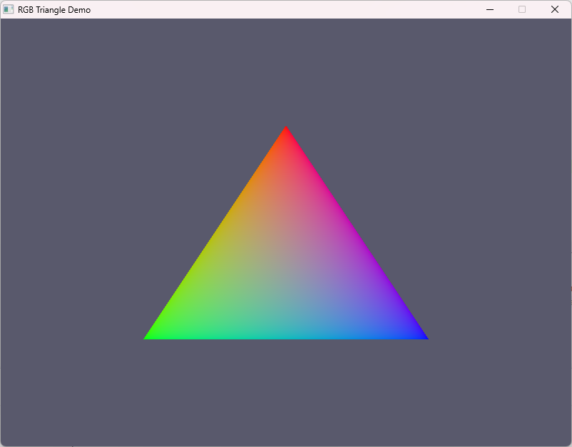

# ⭐ Starfish Game Lib

> **基于 wgpu + SDL3 跨平台游戏库**
> 致力于打造次世代pygame！\
> 服务于python 图形化原型开发者,简单而不失细节！\
> 以「标准渲染对象 + 开发者持有数据」的底层封装为特色。

[](https://www.rust-lang.org)
[](https://wgpu.rs/)
[](https://wiki.libsdl.org/SDL3/)

---

## 📸 截图

<table>
  <tr>
    <td></td>
    <td></td>
  </tr>
  <tr>
    <td align="center">02_triangles — 彩色三角形</td>
    <td align="center">03_texture — 纹理贴图</td>
  </tr>
  <tr>
    <td></td>
    <td></td>
  </tr>
  <tr>
    <td align="center">04_coord_system — MVP 旋转立方体</td>
    <td align="center">05_storage_cube — 实例化渲染 + FPS 相机</td>
  </tr>
  <tr>
    <td></td>
    <td></td>
  </tr>
  <tr>
    <td align="center">06_draw_gfx — 全形状几何绘制（2D/3D）</td>
    <td align="center">07_draw_text — 字体图集文本渲染</td>
  </tr>
</table>

---

## 🖼️ 第三方美术资源
素材取自 LearnOpenGL
作者 Joey de Vries
来源：https://learnopengl.com
许可协议：Creative Commons Attribution 4.0 International (CC BY 4.0)

素材取自 SampleLib
来源：https://samplelib.com/zh/
许可说明：网站原创测试文件，无许可限制，允许下载、修改、使用；素材按现状提供，不提供担保。

---

## ✨ 特性

### 🎨 渲染系统（wgpu 30）

- **特性能力系统**：三层选型许愿（core / recommended / special）+ 硬件掩码——
  设备创建**永不因愿望失败**，`RenderContext::features()` 运行时自查
- **管线全家桶**：深度模式（Standard / Reverse Z / Disabled）、混合
  （Opaque / Alpha / Additive / Multiply / Custom）、MSAA（表面级自动 resolve）、
  面剔除、线框、Stencil、Depth Bias、多边形填充模式
- **纹理全维度**：1D / 2D / 3D / Cube / Array，mipmap 策略可控，
  `write_texture` 局部更新（字体图集 / 视频帧）
- **绑定数组（bindless 地基）**：单批次多纹理，配 `recommended_limits()` 上限愿望
- **查询**：时间戳 / 遮挡查询集创建、解析与回读（profiler 地基）
- **Uniform + Storage Buffer**：StructLayout 自动对齐、dirty 跟踪、实时更新
- **Compute Pipeline**：计算着色器管线 + dispatch
- **多窗口**：`surface_from_context` 共享设备（桌面进阶用法）

### 🔤 字体系统（游戏内文本）

- **自研扫描线光栅化**：非零环绕 + 4×4 超采样抗锯齿，纯 Rust 零新增依赖
- **图集流水线**：字符集 → shelf 打包 → RGBA8 图集上传
- **kern 字距**：字距表解析，排版间距收紧
- **pos3 顶点**：一套布局同时服务 2D（z=0）与 3D（世界坐标 + 深度变体管线）
- **标准 Mesh 对接**：产出的就是引擎 `Mesh`，任意管线直接绘制

### 📐 几何绘制（gfx）

- **16 种 2D/3D 形状**：矩形（填充/描边）、圆、椭圆、正多边形、
  **任意多边形（耳切三角化，凹多边形支持）**、线段/折线、胶囊 2D、
  立方体、UV 球、平面、圆柱、圆锥、胶囊 3D
- **形状参数 = 物理碰撞原语**：AABB / OBB / Sphere / Capsule / Cylinder / Plane
- **矩阵变换**：`Geometry::transformed(&Mat4)` 平移/旋转/缩放
- 填充（TriangleList）与描边（LineList）双管线

### 🔊 音频系统

- **AudioMixer**：多声道混音、通道分组总线、保留通道、音效效果器链
  （`AudioEffect` trait，任意 DSP 自定义）
- **流式 BGM**：SDL3 回调 + 解码线程 + SPSC 环形缓冲——长音频内存恒定，
  排队切歌、seek、淡入淡出
- **录音**：环形缓冲采集、溢出计数、WAV 导出（16-bit PCM）
- **格式**：OGG / MP3 / FLAC / WAV 自动探测（symphonia 纯 Rust）
- **单声道省内存**：单声道源只存一份，混音时展开
- **时间源 = SDL3**：与平台层一致，不引入额外子系统

### ⏱️ 时间系统（SDL3）

- `Clock`：raw / scaled delta 分离（暂停、慢动作）、f64 总时长、EMA 平滑帧率
- `FixedTimestep`：确定性玩法更新，死循环保护
- `sleep_until`：混合节流（睡眠 + 末段自旋，亚毫秒精度）

### 🪟 窗口系统（SDL3）

- 全屏、无边框、窗口模式切换
- 鼠标锁定、相对模式（FPS 相机）
- 高 DPI 支持、窗口透明度、点击测试（hit-test 回调）
- 窗口置顶、最小化/最大化、居中
- **交换链自愈**：拖动窗口/最小化不再崩溃

---

## 🗂️ 项目结构

```
starfish/
├── Cargo.toml              # 依赖配置
├── examples/               # 示例程序（01 起按学习路线编号）
├── resources/              # 资源文件（纹理、着色器、字体、音频）
├── doc/log/                # 更新日志
└── src/
    ├── lib.rs
    ├── base/               # ⚙️ 底层封装（可脱离 pygame 思维直用）
    │   ├── render/         #   渲染系统（管线/绑定/网格/纹理/Pass/特性系统）
    │   ├── gfx/            #   几何绘制（16 种形状生成器 + 填充/线段管线）
    │   ├── font/           #   字体（自研光栅化 + 图集 + 标准对象工厂）
    │   ├── audio/          #   音频（混音器/流式/录音/解码器）
    │   ├── time/           #   时间（Clock/FixedTimestep/节流）
    │   ├── window/         #   窗口封装 + hit-test
    │   ├── subsystem/      #   SDL3 子系统胶水（音频回调/录像/设备枚举）
    │   ├── color.rs        #   HDR 浮点颜色
    │   └── error.rs        #   错误类型
    └── pygame/             # 🐍 pygame 风格接口（Color / Rect）
```

---

## 🚀 快速开始

### 环境要求

- Rust 1.85+
- 支持 Vulkan / Metal / DX12 的显卡
- CMake（SDL3 编译依赖）

### 运行示例

```bash
# 最简示例：清屏
cargo run --example 01_hello_world

# 彩色三角形
cargo run --example 02_triangles

# 纹理贴图（需 resources/textures/wall.jpg）
cargo run --example 03_texture

# 3D MVP 旋转立方体（推荐：含手写 look_at/perspective）
cargo run --example 04_coord_system

# 实例化渲染 + FPS 相机（最完整的 3D 示例）
cargo run --example 05_storage_cube

# 全形状几何绘制（2D 填充/描边 + 3D 环绕相机）
cargo run --example 06_draw_gfx

# 字体图集文本渲染
cargo run --example 07_draw_text

# 音频：音效 + 流式 BGM + 效果器
cargo run --example 08_play_sound
cargo run --example 09_play_music_stream

# 录音（默认 5 秒，保存 recording.wav）
cargo run --example 10_record_mic
```

### 在自己的项目中使用

```toml
[dependencies]
starfish = { git = "https://github.com/GuYeying/starfish" }
```

---

## 📚 示例详解

| 示例 | 展示内容 | 关键 API |
|------|---------|----------|
| 01_hello_world | 窗口创建 + 清屏 | `RenderEntry::new`, `begin_frame`, `present` |
| 02_triangles | 顶点数据 + 着色器 + 管线 + 绘制 | `ShaderModuleBuilder`, `MeshBuilder`, `RenderPipelineBuilder` |
| 03_texture | 纹理加载 + 采样器 + BindGroup | `create_texture`, `create_sampler`, `BindGroupBuilder` |
| 04_coord_system | MVP 矩阵 + 索引缓冲 + 3D 深度 | Uniform Buffer, `look_at`/`perspective`, `render_pipeline_builder_3d` |
| 05_storage_cube | 实例化渲染 + StorageBuffer + FPS 相机 | `StorageBuffer`, `draw_mesh_instanced`, 鼠标控制 |
| 06_draw_gfx | 2D 填充/描边 + 3D 深度遮挡 | `gfx::shape_mesh`, `fill_pipeline_2d/3d`, `Geometry::transformed` |
| 07_draw_text | 字体图集 + 文本 Mesh | `Font::from_file`, `build_atlas`, `text_mesh_tf`, `text_pipeline` |
| 08_play_sound | 混音器 + 效果器 + 淡入淡出 | `AudioMixer`, `SymphoniaDecoder`, `sfx_add_effect` |
| 09_play_music_stream | 流式 BGM + 排队切歌 | `music_load_file`, `music_queue_file`, `music_fade_*` |
| 10_record_mic | 麦克风录音 → WAV | `AudioRecorder::new`, `save_wav`, `dropped` |

---

## 🛠️ 技术栈

| 组件 | 技术 | 版本 |
|------|------|------|
| 图形 API | [wgpu](https://wgpu.rs/) | 30.0 |
| 窗口/输入/音频 | [SDL3](https://wiki.libsdl.org/SDL3/) | 3.4.12 |
| 数学 | [glam](https://docs.rs/glam/) | 0.33 |
| 字体解析 | [ttf-parser](https://docs.rs/ttf-parser/) | 0.25 |
| 音频解码 | [symphonia](https://docs.rs/symphonia/) | 0.5 |
| 纹理加载 | [image](https://docs.rs/image/) | 0.25 |
| 序列化 | [serde](https://serde.rs/) + [serde_json](https://docs.rs/serde_json/) | 1.0 |
| 错误处理 | [thiserror](https://docs.rs/thiserror/) | 2.0 |
| 内存映射 | [bytemuck](https://docs.rs/bytemuck/) | 1.23 |

---

## 📋 开发路线图
- Phase1：完善 Rust 原生底层渲染、音频模块，音频混音管理，搭建稳定底层底座 ✅
- Phase2：搭建 完整 CPU 资源体系，实现基础几何体生成器、不同资源文件类型 ✅（几何体生成器已就位，资源文件类型持续补全）
- Phase3：完善 starfish底层的接口文档,让开发者和AI更容易了解该库
- Phase4：对齐 Pygame 风格高层 API，封装窗口、事件、图像、字体、音频、时间等通用开发接口
- Phase5：基于 PyO3 分层绑定 Rust 核心接口，分批导出窗口、纹理、网格、音频等核心能力，降低 Python 适配维护成本
- Phase6：完善 基于pygame规范的接口文档,让开发者可以进一步了解细致差异
- Phase7：构建 CI 自动打包流程，产出多平台 wheel 分发包，支持pip install一键安装，完善示例与文档
- Phase8：拓展 鸿蒙后端，完成窗口、输入、音频、图形全链路鸿蒙平台适配

---

#### 致特别的人--星

---

## 📄 许可证

Apache License 2.0 © 2025 Starfish Lib Authors
