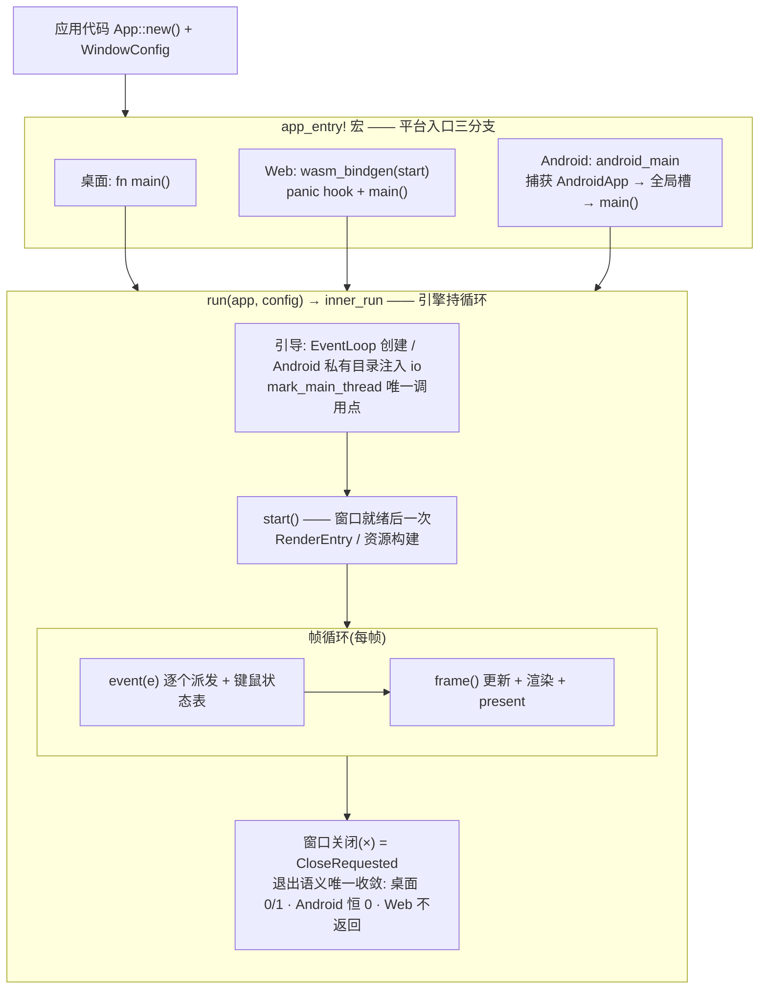

# app 架构（循环模型与统一入口）

> 引擎持循环、回调给应用；`run` + `app_entry!` 两个入口覆盖全平台，
> 应用代码第一行到最后一行零 `#[cfg]`。

## 关键文件

| 文件 | 职责 |
|---|---|
| `src/base/app.rs` | `run` 唯一入口、`Application`/`Ctx`、inner_run 驱动尾、`AndroidApp` 全局捕获槽 |
| `src/lib.rs` | `app_entry!` 统一入口宏（全平台门面） |

## 架构与数据流

```
app_entry!(App::new(), WindowConfig)
 ├─ android: android_main → 捕获 AndroidApp 到全局槽 → main()
 ├─ wasm:    #[wasm_bindgen(start)] panic hook + main()
 └─ 桌面:    fn main()
      ↓ 全部汇入
   run(app, config)
      ↓
   inner_run(event_loop)   ← 节流策略(桌面 Poll / Web Wait+rAF)+ 退出语义唯一收敛处
      ↓                     debug::mark_main_thread 唯一调用点
   Application 三回调: start(窗口就绪一次) → event(逐个派发) → frame(每帧)
```

- **单窗口模型**：引擎持一个主窗口，`ctx.window()` 直取；CloseRequested =
  退出（v1 不可否决）。`RenderSurface` 与窗口 1:1。
- **Android 句柄事务**：`AndroidApp` 只能从 OS 调用的 `android_main` 拿——
  宏生成的 android_main 只做"捕获到 `base::app::ANDROID_APP` 槽 → 调
  main"，`run` 在 Android 上从槽 `take` 完成引导（私有目录注入 io
  base_dir、ndk-context 修正随迁）。
- 三平台退出语义差异收敛在 `inner_run` 尾部一处 cfg：桌面 exit(0/1)、
  Android 恒 exit(0) 清缓存进程、Web 永不返回。

## 生命周期与运作模式



三平台入口形态不同、汇入同一个 `inner_run` 漏斗后完全一致——这是
"应用代码零 cfg"的结构保证。

## 公开 API 速览

```rust
run(app, WindowConfig::new("标题", w, h).with_fps_cap(120))   // 必须主线程
impl Application { fn start(..){} fn event(..){} fn frame(..); } // 仅 frame 必实现
starfish::app_entry!(App::new(), WindowConfig)  // 宏参数 = 纯构造表达式
```

## 平台差异收敛点

平台 cfg **只允许**出现在：`app_entry!` 宏展开、`run`/`inner_run` 的引导
与退出尾、`base/audio` 设备层等库内指定位置。应用代码出现 `#[cfg]` =
架构违规（探针家族是验收标准）。

## 设计纪律

- `run` 三平台同名；Android 的 `run` 依赖宏先捕获句柄——**跳过 `app_entry!`
  手写 android_main 的代码必须自捕获得槽**。
- 宏参数约束：纯构造表达式（多分支展开仅参与类型检查，运行时单次求值）。
- 主线程契约：`run`/窗口操作/事件派发/present 仅主线程（debug 构建有
  `assert_main_thread` 守卫）。

## 测试锚点

`cargo test --lib`（纯逻辑）；probe_window `SIZE PASS`；三目标 lib check。

## 深入入口

`doc/log/starfish_changelog_2026-09-19.md`（入口收敛三轮审读全记录）；
`reference/android构建与运行指南.md`、`reference/wasm运行时生命周期与尺寸竞态问题详解.md`。
