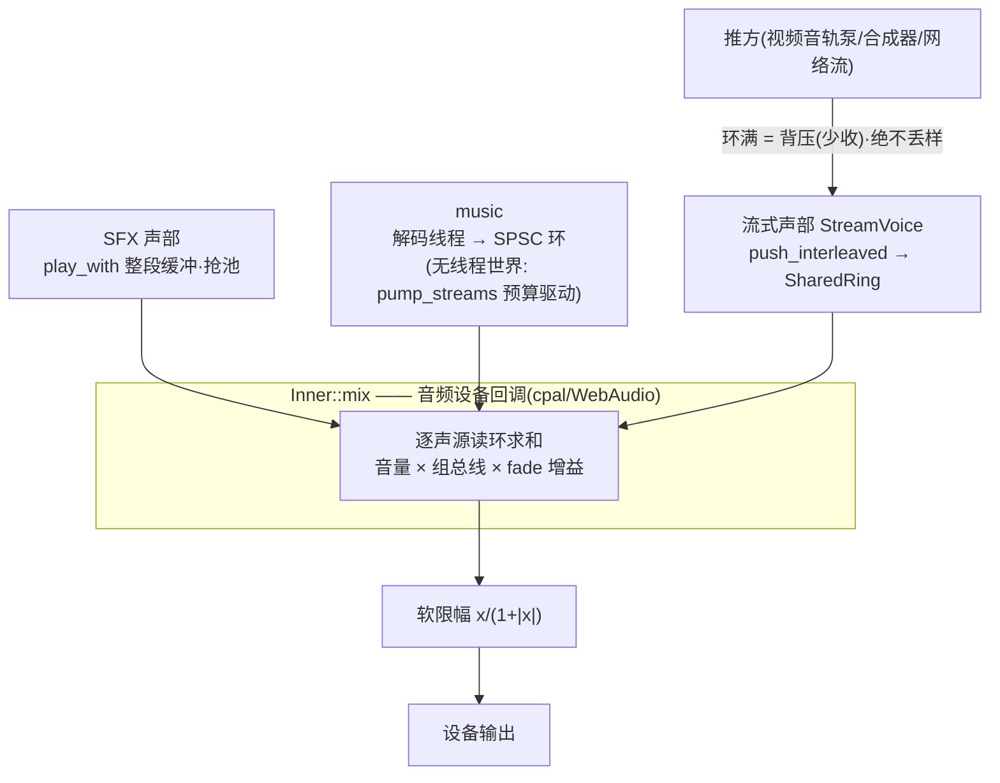
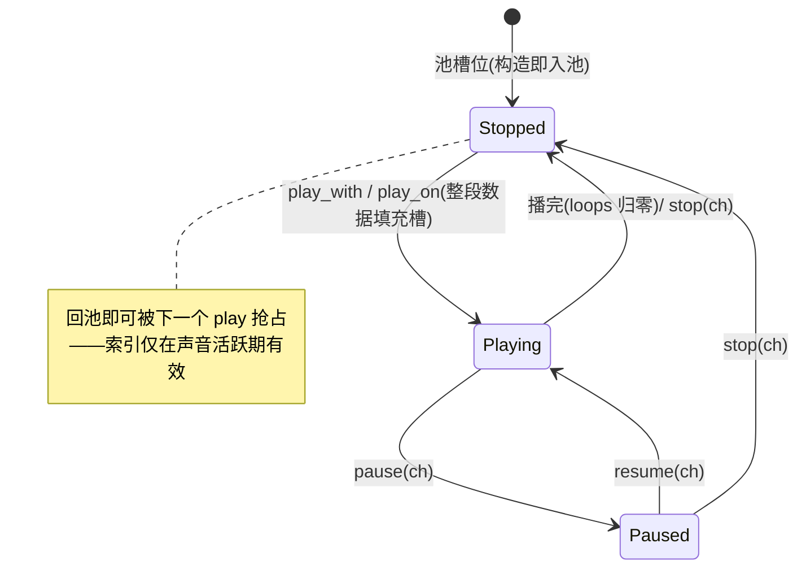
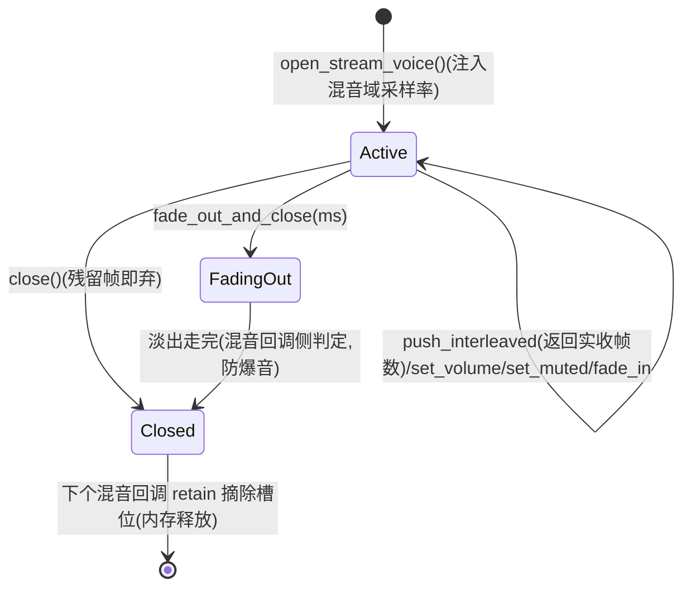

# audio 架构

> 恒参与编译的多声道音频引擎：设备层一处收敛平台差异，混音/流式/录音/
> 解码全部是平台中立纯逻辑。**不假设线程存在**是全模块第一纪律。

## 关键文件

| 文件 | 职责 |
|---|---|
| `audio/mod.rs` | `AudioMixer` 主入口 + `Inner::mix` 混音核心（SFX/music/流式三段汇入） |
| `audio/device.rs`（+ `device_web.rs`） | **cpal 胶水，平台差异唯一收敛点**；wasm 输入采集后端 |
| `audio/sfx.rs` | SFX 声道池（`SfxChannel`：state/data/cursor/loops/volume/pan/fade/effects） |
| `audio/voice.rs` | `StreamVoice` 流式声部（推式 PCM；`StreamVoiceSlot` 对混音回调可见） |
| `audio/music.rs` + `stream/` | music 单例通道 + `MusicStream` 流式解码（worker 线程 / pump 预算驱动） |
| `audio/ring.rs` | SPSC 环形帧缓冲（generation 换代 seek 协议、eof、underrun 统计） |
| `audio/sound_data.rs` | `SoundData`（f32；单声道只存一份混音时展开）+ 整段线性插值 `resample` |
| `audio/resample.rs` | `StreamResampler`——resample 的流式版（跨块插值 + flush 补尾） |
| `audio/record.rs` | `AudioRecorder`（WAV 导出；构造即隐式申请麦克风权限） |
| `audio/decoder/symphonia.rs` | OGG/MP3/FLAC/WAV/AAC 解码（`SymphoniaReader` 逐包 / `Decoder` 整段） |
| `audio/common.rs` | `StereoFrame`/`FadeState`/`AudioError`/`AudioEffect` |

## 架构与数据流

```
三类声源 → Inner::mix(每音频回调) → 软限幅 → 设备
 ├─ SFX 声部    play_with(sound, loops)   整段缓冲抢池,播完隐式回池
 ├─ music       music_load_file(path)     单例,mixer 自带解码线程,SPSC 环
 └─ 流式声部    open_stream_voice()       应用/泵推 PCM → SharedRing → 回调读环
                     ↑ push_interleaved 满则少收 = 背压(消费节奏反压推方)
```

- **混音域 = 设备真实采样率**（`AudioMixer::output_sample_rate`）：cpal 无
  设备边界转换，采样率适配在数据侧——SFX load 时一次性 `resample`，music
  由 worker 重采样，流式由推方用 `StreamResampler`（`StreamVoice::sample_rate()`
  是推帧契约）。
- 无线程环境（Web）：music 解码由游戏循环每帧 `pump_streams(budget)` 驱动；
  流式声部本来就是推方驱动，同一份核心两个世界通用。

## 生命周期与运作模式

**三类声源汇入混音回调**（Bird's eye view）：



**SFX 声道池槽位状态机**（索引式弱句柄）：



**流式声部三段式生命周期**（句柄 Clone 共享，混音回调惰性回收）：



## 公开 API 速览

三家族对照（对称性基线，改动前先看）：

| 能力 | SFX（索引式，池化） | music（单例前缀） | 流式（句柄式） |
|---|---|---|---|
| 发声 | `play_with(sound, loops)` | `music_load_file` + `music_play` | `open_stream_voice()` + `push_interleaved` |
| 音量 | `set_channel_volume(ch, v)` | `music_set_volume` | `voice.set_volume` |
| 淡变 | `channel_fade_in/out(ch, ms)` | `music_fade_in/out` | `voice.fade_in` / `fade_out_and_close` |
| 停止 | `stop(ch)`（回池） | `music_stop` | `voice.close()`（销毁，混音回调惰性摘除） |
| 静音 | —（音量 0 代替） | — | `set_muted` |
| 位置 | `get_channel_sound` | `music_position/duration` | `pushed_frames` |

已知不对称清单（2026-09-20 排查，勿误当作既定设计）：流式缺 pause/resume
与 buffered 水位；`channel_fade_*` 词序是 SFX 侧历史异类；`close()` 后
push 仍返回全收（诚实性问题）；SFX 槽位索引是弱句柄（回池可被复用）。

## 平台差异收敛点

仅 `device.rs`（native cpal）与 `device_web.rs`（WebAudio 输入采集）；
条件编译只回答"谁来驱动"（解码线程 vs pump），共用核心零 cfg。

## 设计纪律

- **共用核心不得假设线程存在**：新增能力先想"无线程世界怎么驱动"。
- JoinHandle 绝不在与音频回调共享的锁内 join（`join_retired` 锁外收口）。
- 环形缓冲满 = 背压少收，**绝不丢样**（丢样会爆音）。
- 每路流式声部 = 独立 `StreamVoiceSlot`（128KB 环 + 独立控制面），closed
  由混音回调惰性摘除；fade_out 走完自动 close 防爆音。

## 测试锚点

`cargo test --lib`：ring SPSC 压力/换代、group 混音衰减、resample 整段/流式
一致性、AAC 解码非全零、音轨泵背压/整轨推完。probe_audio
`DECODE/PLAY/DONE PASS`；probe_record `WAV PASS`（无头环境判 SKIP）。

## 深入入口

`doc/log/starfish_changelog_2026-09-19.md` 批次 6⑨（三类声源定稿）、
`doc/log/starfish_changelog_2026-09-20.md` 批次 8（SFX/流式资源模型对比与
选择判据）。
