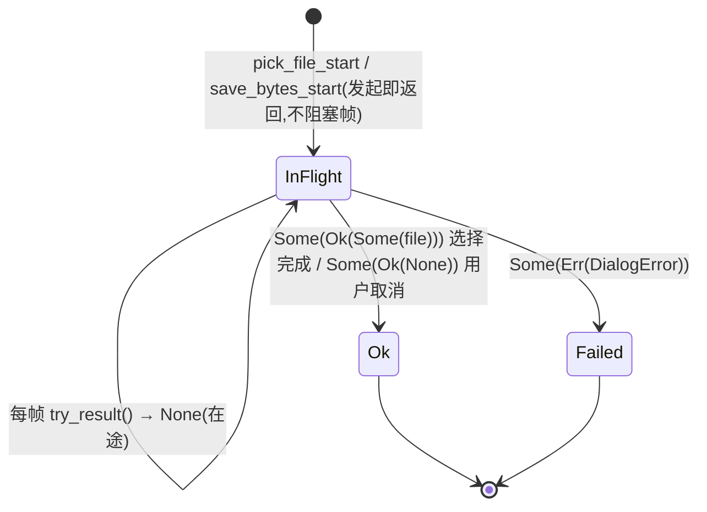
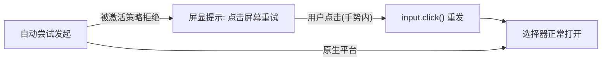

# dialog 架构（feature = "dialog"）

> 统一异步对话框：文件选择/保存三平台一套 API，双形态（async / 轮询式
> Job），游戏循环零阻塞。

## 关键文件

| 文件 | 职责 |
|---|---|
| `dialog.rs` | `pick_file` / `save_bytes`（async）+ `pick_file_start` / `save_bytes_start`（轮询式 Job：`PickJob`/`SaveJob` + `try_result`）；`PickedFile`（name/read 直读）；平台 imp 段 |

## 架构与数据流

```
双形态,同一结果模型:
  async:      pick_file(..).await  /  save_bytes(name, data).await
  轮询式:     let mut job = pick_file_start(..)?;   // 发起即返回
              job.try_result()  → None = 在途      // 每帧问一次,游戏循环零阻塞
                                  Some(Ok(Some(file)|None))  = 文件 / 用户取消
结果: PickedFile { name(), read() }  选择即读进内存,统一消费
      保存 → Ok(写入路径 PathBuf);失败 → DialogError
```

- **平台后端**：桌面 rfd（GTK3 需系统包）；Web `input[file]` 选择读入内存
  + Blob/objectURL 触发下载保存；移动端 robius 系统文件选择器（Android
  SAF 走 FilePickerFragment，APK 需 classes.dex + `hasCode="true"`——xtask
  自动并入）。

## 生命周期与运作模式

**轮询式 Job 状态机**（async 形态是同一状态机的 await 包装）：



**Web 用户手势重试模式**（浏览器激活策略下的标准打法）：



## 公开 API 速览

见上表；`DialogError` 显式错误。**Web 限制**：文件选择器必须在用户手势内
打开（浏览器激活策略）——自动发起会被拒，须点击屏幕重试（probe_dialog
的点击重试模式是标准打法）。

## 平台差异收敛点

imp 段内 cfg；公开面全平台同名。Android SAF 背靠背拉起两个选择器 Activity
在容器上有竞态——**两次对话框之间要隔人的操作间隔**（9-19 批次 7 实测教训）。

## 设计纪律

对话框永远**不阻塞帧循环**：桌面 rfd 虽是同步 API，也包在轮询式 Job 里
后台化——新增对话框能力必须提供 `try_result` 形态。

## 测试锚点

probe_dialog：`START PASS`（无头可自动判定）→ `RESULT`（需人工/手势）→
`SAVE`；web 无头 START 锚点；Android 实机 pick→点击→save 全程。

## 深入入口

`doc/log/starfish_changelog_2026-09-19.md` 批次 7（真实浏览器/卓易通反馈
修正——激活策略与 SAF 背靠背竞态）。
