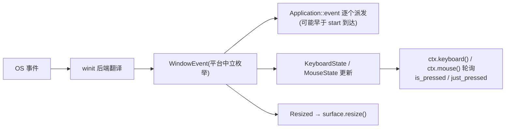

# window 架构

> 平台中立的窗口 + 事件模型：自有枚举，winit 只做后端翻译；单窗口，
> 键鼠状态表轮询 + 事件双轨（对齐 pygame 心智）。

## 关键文件

| 文件 | 职责 |
|---|---|
| `window/window.rs` | `Window` 封装（HasWindowHandle/HasDisplayHandle 直通，wgpu 建表面零第三方转发） |
| `window/event.rs` | `WindowEvent` / `KeyCode` / `MouseButton` / `KeyModifiers`（平台中立枚举）+ `KeyboardState` / `MouseState` 状态表 |
| `window/mod.rs` | 导出面 |

## 架构与数据流

```
OS 事件 → winit → 翻译为 WindowEvent → 逐个派发 Application::event
                                     → 同步更新 KeyboardState/MouseState
应用两条读取路径: event 回调(事件驱动) + ctx.keyboard().is_pressed(..)(轮询)
```

- **单窗口模型**：引擎持一个主窗口（决策 2026-09-14，多窗口剔除），
  `ctx.window()` 直取；点 × = CloseRequested = 应用退出（v1 不可否决）。
- pygame 常量别名（`K_w` 等）未来由 pygame/ 层做，base 层保持中立枚举。

## 生命周期与运作模式

**事件双轨流**（事件驱动 + 状态表轮询，对齐 pygame 心智）：



**窗口生命周期**：创建（`run` 引导，Web 接管 canvas 初始 0×0）→
start（首个有效尺寸）→ 帧循环（事件+渲染）→ CloseRequested（点 ×）→
退出，v1 不可否决。

## 公开 API 速览

`ctx.window()`；`ctx.keyboard()`/`ctx.mouse()`（状态表轮询）；
`WindowEvent::Resized { width, height }` 等；`KeyCode`/`MouseButton` 枚举。

**窗口特性 flags**（`WindowConfig` 创建期，2026-09-20）：`decorations`
（无边框）/ `transparent`（透明——**创建期一次性**，winit 平台限制）/
`always_on_top` / `fullscreen`（Borderless）/ `visible`（隐藏启动）/
`cursor_visible` / `resizable` / `maximized`；运行时切换（`Window`）：
`set_decorations` / `set_fullscreen` / `set_maximized` / `set_minimized` /
`set_always_on_top` / `set_cursor_visible` / `set_relative_mouse` /
`set_cursor_grab` / `set_visible`。

## 平台差异收敛点

### 窗口 flags 的平台矩阵与处理策略

**处理策略（三层）**：① 代码层**零平台分叉**——flag 全量传递给 winit
`WindowAttributes`,winit 后端对不支持的能力自行静默忽略（收敛点即后端
翻译，本层不 fork cfg）；② 契约层 flag **永不报错永不 panic**——best-effort
增强，规范性平台 = 桌面（Windows 为准），Web/Android 定位"增强失败不破坏
游戏"；③ 文档层按下表记录已知降级行为（winit 无运行时能力查询，自造
支持表会与实际漂移，故矩阵住文档不住代码）。

| flag | Windows | macOS | Linux/X11 | Linux/Wayland | Web | Android |
|---|:-:|:-:|:-:|:-:|:-:|:-:|
| `decorations` | ✓ | ✓ | ✓ | ✓ | 忽略（canvas 无装饰） | 忽略 |
| `transparent` | ✓ DWM | ✓ | ✓ 需合成器 | ✓ | ⚠️ 取决 canvas 合成，待实测 | 忽略 |
| `always_on_top` | ✓ | ✓ | ✓ | ✗ 协议不允许 | 忽略 | 忽略 |
| `fullscreen` | ✓ | ✓ | ✓ | ✓ | ⚠️ 需用户手势（浏览器激活策略，boot 期可能被拒） | 天然全屏 |
| `visible` | ✓ | ✓ | ✓ | ✓ | DOM 可见性 | 忽略 |
| `cursor_visible` | ✓ | ✓ | ✓ | ✓ | ✓ CSS cursor | 无光标概念 |

已知的两个坑：Wayland 在协议层面禁止置顶（"桌面"内部也有差异）；Web
fullscreen 与 dialog 文件选择器同受浏览器用户激活策略约束（点击后重试
模式同款）。运行时切换方法（`set_*`）的降级行为与创建期 flag 相同。

### 其余收敛点

winit 后端翻译在库内完成；Android 走 android-native-activity（NativeActivity
模板），Web 由 winit 接管 canvas（`with_web_canvas_id`，初始 0×0 经
ResizeObserver 异步到达——Resized 必须调 `surface.resize()`，见 CLAUDE.md
Web 坑位 1/2）。

## 设计纪律

- 事件模型改动 = 全平台联动：桌面/Web/Android 三路翻译都要过。
- Web 的 `ControlFlow::Wait`（非桌面 Poll）是帧节奏命脉，勿"统一"成 Poll。

## 测试锚点

probe_window `SIZE PASS 800x600`（三平台）；web 无头存活模式。

## 深入入口

`reference/wasm运行时生命周期与尺寸竞态问题详解.md`；`doc/log/` 2026-09-14
（单窗口定稿）。
