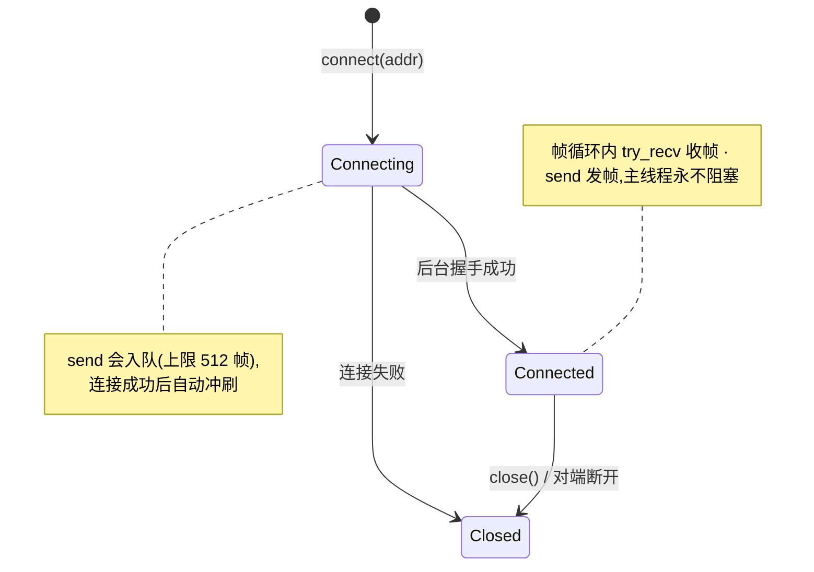

# net 架构（feature = "net"）

> TCP 消息连接 + UDP 轮询，`Connection` trait 统一接口；后台线程直连，
> **零 tokio**。非阻塞轮询风格对齐游戏循环。

## 关键文件

| 文件 | 职责 |
|---|---|
| `net.rs` | `TcpConn` / `UdpSock` / `Connection` trait / `ConnState` / `NetError`；wasm 段 WebSocket 映射 |

## 架构与数据流

```
TcpConn::connect(addr)                    UdpSock::bind(local)
  └─ 后台线程:阻塞收发                     └─ 数据报直收发(无连接)
     控制面: state()/send()/try_recv()        控制面: send_to()/try_recv_from()/set_broadcast()
     ↓ 消息边界保留,帧内 try_recv 轮询
Connection trait ── TcpConn 与 WebSocket 同一消费形态(应用零 cfg)
```

- **Web**：TCP 语义映射 WebSocket（js-sys，`net` 特性门）；浏览器无 UDP →
  `UdpSock::bind` 返回 Err——**能力缺失显式可测**（探针判 SKIP 非 FAIL）。
- Android `Internet` 权限：`TcpConn::connect` / `UdpSock::bind` 隐式声明
  （permission 模块，清单由 xtask APK 模板统一声明）。

## 生命周期与运作模式

**TcpConn 连接状态机**（`connect` 立即返回，握手在后台线程）：



**帧收发运作**（轮询式语义，对齐手柄/视频泵模式）：4 字节长度头 + 载荷
（单帧上限 16MB 防爆内存）；`Connection` trait 使 TCP(原生) / WebSocket(Web)
同一消费形态，应用在 `frame` 里轮询即可。

## 公开 API 速览

`TcpConn::{connect, state, send, try_recv, close}`；
`UdpSock::{bind, send_to, try_recv_from, set_broadcast}`；`ConnState`；
`impl Connection for ...`（自定义传输的接入点）。

## 平台差异收敛点

仅 wasm 段（WebSocket）；native 全平台 std::net 直用。

## 设计纪律

- **零 tokio 铁律**：后台线程 + 标准库阻塞 IO——不往依赖树里拽异步运行时。
- API 一律非阻塞轮询态：`try_recv`/`try_recv_from` 即刻返回，绝不阻塞帧。

## 测试锚点

probe_net（`server.py` 对端）：桌面 `DISCOVER → TCP PASS → UDP PASS →
VERDICT PASS`；web 无头 `UDP SKIP + TCP PASS + VERDICT PASS`（TCP 为底线）。

## 深入入口

`doc/log/` 2026-09-18（net 模块立项）。
