# probe 架构（examples/probe/ 跨平台验收基建）

> 探针家族 = 模块独立测试案例：验证**一套源码、零 `#[cfg]` 跑全平台**。
> 应用代码无条件编译；平台差异只允许收敛在 `app_entry!` 宏、库入口函数族
> 与 kit.rs 三处。**新增模块 = 加一个探针**。

## 关键文件

| 文件 | 职责 |
|---|---|
| `examples/probe/kit.rs` | 共享 harness（581 行，**kit 内允许 cfg**——全库唯一例外） |
| `examples/probe/probe_<名>.rs` × 10 | window/font/gfx/audio/record/video/gamepad/dialog/net/io |
| `examples/probe/../server/server.py` | probe_io/net 的对端（TCP/UDP/WS echo）+ `--resources-dir` 静态挂载 + saves POST 端点 |

## kit.rs 组成（共享 harness）

- **`StatusPanel`**：多行状态面板（内嵌字体图集 + 相机/管线装配 + 每帧按
  `ctx.size()` 写投影）；`with_gpu` 作用域化 GPU 访问；Resized→resize 内置。
- **`Status` 三态判定**：`Pass / Skip / Fail`（+ Info/Pend）——**能力缺失
  （Web 无 UDP、无头无麦克风）= SKIP 非 FAIL**；`verdict(probe, tag, status,
  detail)` 双通道 = 屏显 + console 锚点 `[{probe}] {TAG} PASS|SKIP|FAIL detail`。
- **平台感知查询**（调用点零 cfg）：`asset_path(逻辑路径, include_bytes!)`
  （桌面/web 原样；Android 内嵌字节幂等落盘私有目录——三平台同一字符串）、
  `save_path`（web 补 saves/ 前缀）、`page_hostname`（web 拼 ws://）、
  `enable_broadcast`、统一轮询式对话框 `PickJob`/`SaveJob`。

## 无头判读（CI/agent 自动验收通道）

```
存活模式: msedge --headless=new --enable-logging=stderr <url>   # 不带 virtual-time-budget
收割:     console 流 grep "[probe] TAG PASS";收尾 taskkill /T /F
```

- 判定只走 `console_log`（wasm 上 `println!` 无处可去）。
- 时间类探针（video/audio/record）**必须存活模式**：虚拟时间会冻结
  `ctx.delta()` 且无报错（CLAUDE.md Web 坑位 7）。
- 环境容差：audio 加 `--autoplay-policy=no-user-gesture-required`；record
  加 fake-device flags；dialog 文件选择器需用户手势（点击即重试）。

## 判定流（三态运作模式）

```mermaid
flowchart LR
  Chk["探针判据执行"] -->|"能力缺失<br/>(Web 无 UDP / 无头无麦克风)"| SK["SKIP<br/>= 环境容差,非失败"]
  Chk -->|"验证通过"| PA["PASS"]
  Chk -->|"失败 / 异常"| FA["FAIL<br/>detail 上屏 + console"]
  PA --> V["verdict 双通道"]
  SK --> V
  FA --> V
  V --> SC["屏显: 状态面板行着色"]
  V --> CO["console 锚点:<br/>&#91;probe&#93; TAG PASS&#124;SKIP&#124;FAIL detail<br/>(无头收割的契约格式)"]
```



## 设计纪律

- **借用纪律**：探针状态机阶段借用内只计算结果（enum Out），动 self 的
  调用放借用结束后（`if let &mut self.step` 内调 `self.finish()` 必 E0499）。
- 探针的判据锚点是**契约**：改判据输出格式 = 同时改无头收割脚本。
- 同源双注册：同一文件注册 bin + `*_android` cdylib 两条 `[[example]]`
  （Cargo.toml），入口统一 `app_entry!`。

## 测试锚点

各探针锚点表见 CLAUDE.md「探针与统一入口」；10 件 wasm 构建 + 无头收割
全 PASS 是批次合入的验收基线。

## 深入入口

`doc/log/starfish_changelog_2026-09-19.md` 批次 3~8（探针设计 + 真实环境
反馈修正）；CLAUDE.md「Web 关键坑位」「Android 构建」两节。
