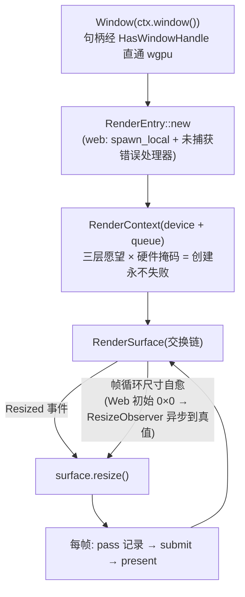

# render 架构

> wgpu 30 封装：**特性许愿系统**保证设备创建永不失败；**标准渲染对象 =
> 开发者持有数据**（Mesh/管线/BindGroup 由 Builder 构造，无隐藏全局状态）。

## 关键文件

| 文件 | 职责 |
|---|---|
| `render/render_context.rs` | `RenderContext`：device/queue 持有、`features()` 运行时自查 |
| `render/features.rs` | 三层愿望（core / recommended / special）+ 硬件掩码求交 |
| `render/render_entry.rs` | 表面初始化（窗口句柄直通 wgpu；wasm 未捕获错误处理器沿 source 链展开） |
| `render/render_surface.rs` | 交换链封装（Resized→resize、WebGL2 格式/present_mode 掩码、view_formats Web 置空） |
| `render/settings.rs` | `SurfaceSettings` |
| `render/pipeline/` · `bind_group/` · `mesh/` · `texture/` · `shader_module/` | 各类 Builder（开发者持有产物） |
| `render/render_pass/` · `command_encoder.rs` | Pass 与提交 |
| `render/render_resource_access.rs` | GPU 资源访问面（kit 的 `with_gpu` 作用域化入口底层） |
| `render/sampler_desc.rs` · `ext/` | 采样器描述 / 扩展 |

## 架构与数据流

```
Window → RenderEntry → RenderContext(device/queue + features 愿望求交)
      → RenderSurface(交换链; resize 自愈)
应用侧: Builder 构造 Mesh / RenderPipeline / BindGroup / Texture
      → RenderPass 记录 → command encoder 提交 → present
```

- **特性许愿三层**：core（必有）/ recommended（有则更好）/ special（锦上
  添花）× 硬件掩码 → 设备创建**永不因愿望失败**，运行时 `features()` 查真有
  什么。绑定数组（bindless 地基）配 `recommended_limits()` 上限愿望。
- **对象直绑**：`Video::texture_view()`、字体图集等产出的就是引擎标准对象，
  `BindGroupBuilder::texture_view` 裸视图入参，绑定一次管到底（同尺寸覆写
  不重建视图）。

## 生命周期与运作模式

**渲染初始化阶梯与交换链自愈**：



**资源对象生命周期**（标准渲染对象 = 开发者持有）：Builder 构造 →
开发者持有 `Mesh`/`RenderPipeline`/`BindGroup` → 显式销毁随作用域；纹理
同尺寸覆写不换视图（`Arc<TextureView>` 绑定一次管到底），尺寸变化才重建。

## 公开 API 速览

`RenderContext::features()`；`*_builder(...).build(...)` 家族（mesh /
shader_module / render_pipeline_2d_3d / bind_group）；`create_sampler`；
`RenderSurface::resize`（Resized 事件必调，帧循环另有尺寸自愈）。

## 平台差异收敛点

`pollster::block_on` 仅在 `cfg(not(wasm32))` 分支（wasm 走 spawn_local）；
WebGL2 掩码在 `SurfaceSettings::to_wgpu`（view_formats 置空、交换链格式仅
`[Rgba8Unorm, Rgba8UnormSrgb, Rgba16Float]`）。

## 设计纪律

- Web 未捕获错误处理器（render_entry wasm 分支）沿 source 链展开完整原因
  ——Web 上 wgpu 错误直接给精确信息，**不许删**。
- 双后端 webgl + webgpu 同编：`navigator.gpu` 存在选 WebGPU，缺失自动落
  WebGL2，同一份二进制自动降级。

## 测试锚点

probe_gfx `BUILD/DRAW PASS`（overlay 自建双管线 4 形状）；三平台编译 +
wasm 无头渲染截屏闭环（诊断工具链见 CLAUDE.md Web 坑位 6）。

## 深入入口

`reference/`（着色器笔记）；`doc/log/` 各批次（管线能力渐次落地记录）。
