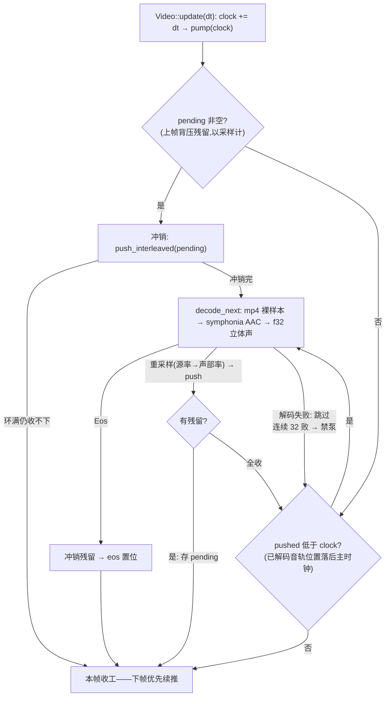

# video 架构

> 六平台 H.264 硬解 + 全平台同一软解音轨。**硬解唯一策略**：无硬件解码器
> 直接报错，永不落软解画面。非侵入式：解码只发生在 `Video::update`。

## 关键文件

| 文件 | 职责 |
|---|---|
| `video/mod.rs` | `VideoModule`（open / open_with_audio / open_backend 分发）、`DecodeBackend` seam、`Poll`/`DecodedFrame` |
| `video/player.rs` | `Video` 播放状态机（主时钟 / 追帧纪律 / 纹理管理 / 音轨泵驱动点） |
| `video/windows.rs` · `linux.rs` · `apple.rs` | MF / GStreamer / VideoToolbox 硬解后端（自带解复用） |
| `video/web.rs` | WebCodecs 后端（自持绑定 + `fetch_bytes` 共用加载前端） |
| `video/android.rs` | MediaCodec 后端（与 web 共用 mp4_demux） |
| `video/mp4_demux.rs` | 纯 Rust 解复用：`Demuxer`（视频轨→Annex-B，android/web/test 门控）+ `AudioDemuxer`（音轨，全平台） |
| `video/audio_track.rs` | 音轨泵：裸 AAC → symphonia → 重采样 → StreamVoice |
| `../yuv.rs` | NV12 → RGBA 定点转换（video/camera 共用） |

## 架构与数据流

```
open(path)                 open_with_audio(path, voice)
   │ Dimuxer 不参与(桌面)      │
   ▼                          ▼
平台硬解后端(seam)          平台硬解后端  +  AudioPump(全平台同一份)
   │ poll_frame → NV12         │ update(dt) 内: pushed < clock 才解码
   ▼                          ▼
Video::update(dt)          symphonia AAC(裸 GA 帧+CodecParameters)
   │ 追帧只上传最新帧           ▼ StreamResampler(44100→混音域)
   ▼                          ▼ push_interleaved(背压满即停推)
纹理(texture_view 直绑管线)   StreamVoice → mixer 流式声部
```

- **主时钟**：`Video::update` 累计 dt；追帧（落后多帧）只上传最新帧；Web
  异步解码 `Poll::Pending` 时钟照走。遮挡（`set_video_enabled(false)`）=
  画面冻结、时钟与音轨照走。
- **音轨同步 v1 = 视频时钟**：泵首帧对齐（`pushed = clock`，中途打开不回放
  历史）；背压残留 `pending` 下帧优先冲销，绝不丢样；④ 精确同步（锚 ring
  读点）未立项。
- **音轨容错**：单帧解码失败跳过，连续 32 帧失败才禁泵（console_log）——
  坏音轨不拖死画面。native 装配失败同步返回 Err；web 异步失败静音降级。

## 生命周期与运作模式

**Video 运作模式**（`update(dt)` 是唯一驱动点）：

```mermaid
stateDiagram-v2
  [*] --> Loading: open / open_with_audio
  Loading --> Ready: 资源就绪 is_ready=true(桌面同步直达;web=异步 fetch,时钟不推进)
  Ready --> Playing: 首次 update(dt) 解码首帧(纹理懒创建)
  Playing --> Playing: 追帧循环 position 低于 clock·中间帧解码即弃·只上传最新帧
  Playing --> Occluded: set_video_enabled(false)——画面冻结<br/>时钟照走·音轨照走
  Occluded --> Playing: 恢复 enabled——快速解码(不上屏)追至主时钟,无需 seek
  Playing --> Ended: Poll::Eos → ended 置位,update 从此 no-op(ring 残余由混音侧排空)
  Ended --> [*]
```

**音轨泵单帧运作循环**（背压纪律：绝不丢样、不阻塞帧）：



**纹理生命周期**：首帧懒创建（含 Web 的 RENDER_ATTACHMENT 附加用法）→
同尺寸整帧覆写（视图 `Arc<TextureView>` 稳定，绑定一次管到底）→ 尺寸
变化才重建。

## 公开 API 速览

```rust
VideoModule::new(device, queue).open(path)?                        // 无声
    .open_with_audio(path, voice)?                                 // 挂流式声部
video.update(dt)?;  video.texture_view() → BindGroupBuilder
video.set_audio_volume(v); video.set_muted(b); video.has_audio()
video.position() / size() / ended() / set_video_enabled(b)
```

## 平台差异收敛点

后端分发只在 `open_backend` 一处 cfg；mp4_demux 的视频 `Demuxer` 仅
android/web/test 编译（桌面后端自解复用），音轨 `AudioDemuxer` + 音轨泵
**全平台同一份**（音频无硬解承诺，源文件双开是既定架构）。

## 设计纪律

- **AAC = 裸 GA 帧直喂 symphonia**：解码入口不解析 ADTS 头；采样率/声道经
  `CodecParameters`（0.5 为公开字段非 setter）声明——勿按旧设计打 ADTS。
- 格式承诺仅 H.264/MP4；AAC-LC 立体声契约（声道 >2 拒绝）。
- Web 上 `WasmVideoFrame` Drop 即 close()：追帧丢弃路径及时释放浏览器 GPU 资源。

## 测试锚点

lib：`demux_real_sample_file`（1920×1080/pts 单调）、`audio_demux_real_sample_file`
（AAC-LC/44100/立体声）、`aac_decode_produces_nonzero_pcm`（**全轨判读**——
资产开头 ~370ms 静音引导，只测前几帧会误判全零）、音轨泵背压/整轨。
probe_video：`OPEN/FIRST/AUDIO/ENDED PASS`（AUDIO = 推帧计数，无头可判）。

## 深入入口

`reference/video硬解抽象设计笔记.md`；`doc/log/starfish_changelog_2026-09-20.md`
（音轨落地 + ADTS 风险反转）。
