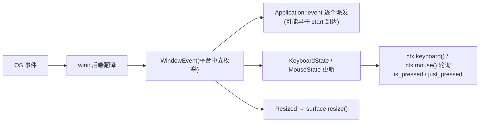

# window 架构

> 平台中立的窗口 + 事件模型：自有枚举，winit 只做后端翻译；单窗口，
> 键鼠状态表轮询 + 事件双轨（对齐 pygame 心智）。

## 关键文件

| 文件 | 职责 |
|---|---|
| `window/window.rs` | `Window` 封装（HasWindowHandle/HasDisplayHandle 直通，wgpu 建表面零第三方转发） |
| `window/event.rs` | `WindowEvent` / `KeyCode` / `MouseButton` / `KeyModifiers`（平台中立枚举）+ `KeyboardState` / `MouseState` 状态表 |
| `window/mod.rs` | 导出面 |

## 架构与数据流

```
OS 事件 → winit → 翻译为 WindowEvent → 逐个派发 Application::event
                                     → 同步更新 KeyboardState/MouseState
应用两条读取路径: event 回调(事件驱动) + ctx.keyboard().is_pressed(..)(轮询)
```

- **单窗口模型**：引擎持一个主窗口（决策 2026-09-14，多窗口剔除），
  `ctx.window()` 直取；点 × = CloseRequested = 应用退出（v1 不可否决）。
- pygame 常量别名（`K_w` 等）未来由 pygame/ 层做，base 层保持中立枚举。

## 生命周期与运作模式

**事件双轨流**（事件驱动 + 状态表轮询，对齐 pygame 心智）：



**窗口生命周期**：创建（`run` 引导，Web 接管 canvas 初始 0×0）→
start（首个有效尺寸）→ 帧循环（事件+渲染）→ CloseRequested（点 ×）→
退出，v1 不可否决。

## 公开 API 速览

`ctx.window()`；`ctx.keyboard()`/`ctx.mouse()`（状态表轮询）；
`WindowEvent::Resized { width, height }` 等；`KeyCode`/`MouseButton` 枚举。

## 平台差异收敛点

winit 后端翻译在库内完成；Android 走 android-native-activity（NativeActivity
模板），Web 由 winit 接管 canvas（`with_web_canvas_id`，初始 0×0 经
ResizeObserver 异步到达——Resized 必须调 `surface.resize()`，见 CLAUDE.md
Web 坑位 1/2）。

## 设计纪律

- 事件模型改动 = 全平台联动：桌面/Web/Android 三路翻译都要过。
- Web 的 `ControlFlow::Wait`（非桌面 Poll）是帧节奏命脉，勿"统一"成 Poll。

## 测试锚点

probe_window `SIZE PASS 800x600`（三平台）；web 无头存活模式。

## 深入入口

`reference/wasm运行时生命周期与尺寸竞态问题详解.md`；`doc/log/` 2026-09-14
（单窗口定稿）。
